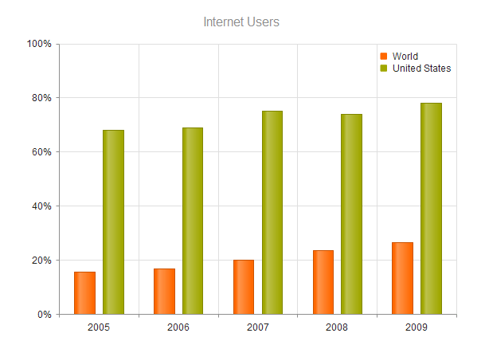

# Title and Legend

The Kendo UI Chart supports options for configuring the appearance of its title and legend.

## Setting the Title

To control the position of the title, use the following available `position` options of the `title` property:

* `"top"`
* `"bottom"`

## Setting the Legend

The Chart legend displays the name of the configured data series.

* To control the position of the legend, use any of the following supported `position` values:

        * `"top"`
        * `"bottom"`
        * `"left"`
        * `"right"`
        * `"custom"`

* To customize the position of the legend, use the `offsetX` and `offsetY` options.

    

* To exclude series from the legend, set their `visibleInLegend` option to `false`.

## See Also

* [Using the API of the Chart (Demo)](https://demos.telerik.com/kendo-ui/chart-api/index)
* [JavaScript API Reference of the Chart](/api/javascript/dataviz/ui/chart)
