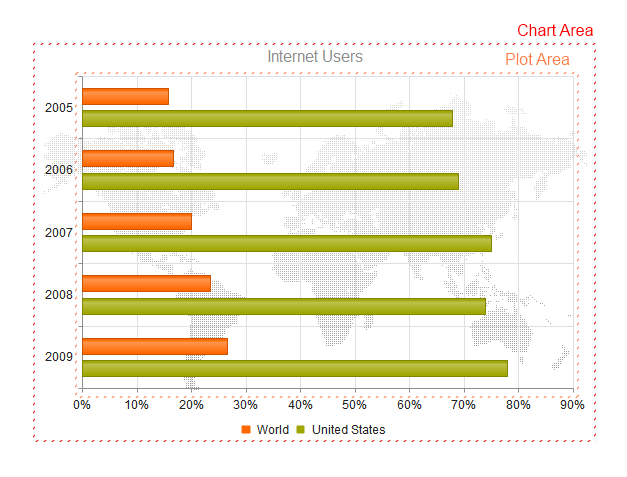
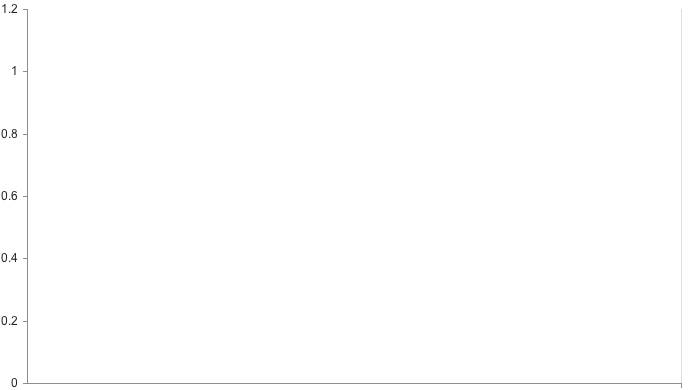
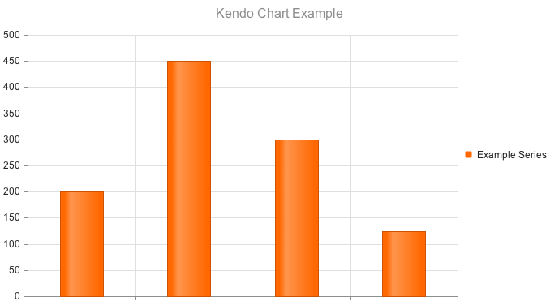
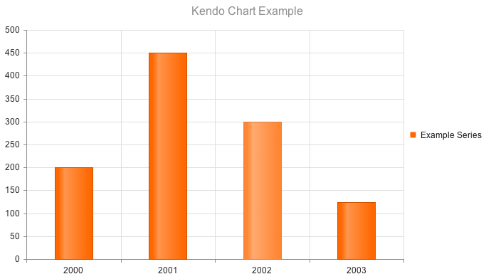

# Chart Overview

The Kendo UI Chart uses modern browser technologies to render high-quality data visualizations.

All graphics are rendered on the client by using [Scalable Vector Graphics (SVG)](https://en.wikipedia.org/wiki/Scalable_Vector_Graphics) with a fallback to [Canvas](http://www.canvasgfx.com/). The Charts support a [set of series types]() such as Bar, Line, Area, Bullet, Pie, Scatter, Bubble, Polar, and other.

The Chart contains the following [building block elements]():

* Title
* Legend
* Chart Area
* Plot Area
* Axes
* Series

The following image displays the structure of the Chart.

* [Demo page for the Charts](https://demos.telerik.com/kendo-ui/)

## Basic Configuration

To create a Chart, add an empty `div` to the HTML, provide it with an ID, and , optionally, set the width and height of the desired Chart inline or with CSS.

    

To render the Chart, select the `div` with a jQuery selector and call the `kendoChart()` function.

    $("#chart").kendoChart();

The previous example results in the following output.

You can add a title to the Chart by specifying the `text` property of the `title` object.

    $("#chart").kendoChart({
        title: {
             text: "Kendo Chart Example"
        }
    });

The Chart can also visualize series that are bound to both local and remote data. The following example demonstrates how to bind the Chart to local data.  

    $("#chart").kendoChart({
        title: {
             text: "Kendo Chart Example"
        },
        series: [
             { name: "Example Series", data: [200, 450, 300, 125] }
        ]
    });

The previous example results in the following output.

To add labels across the category axis of the Chart columns, specify the labeling for the series in the [`categoryAxis`](/api/dataviz/chart#categoryAxis) property.

    $("#chart").kendoChart({
        title: {
             text: "Kendo Chart Example"
        },
        series: [
             { name: "Example Series", data: [200, 450, 300, 125] }
        ],
        categoryAxis:{
             categories: [ 2000, 2001, 2002, 2003 ]
        }
    });

The previous example results in the following output.

## Functionality and Features

* [Data binding]()
* [Export]()
* [Appearance]()

## See Also

* [Using the API of the Chart (Demo)](https://demos.telerik.com/kendo-ui/chart-api/index)
* [JavaScript API Reference of the Chart](/api/javascript/dataviz/ui/chart)
