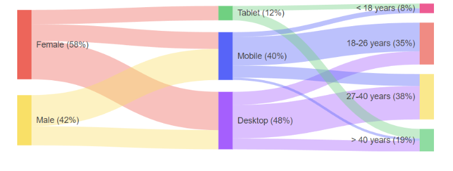

# {{ site.framework }} Sankey Diagram Overview

The Kendo UI for jQuery Sankey Diagram allows you to create diagrams that visualize changing flows and their distribution between domains. Sankey diagrams suit a variety of use cases like the representation of website traffic, budget breakdowns, energy flow, and others.

The Kendo UI for jQuery Sankey Diagram includes the following customizable elements:

- Nodes&mdash;The node is a rectangular element that connects to other nodes.
- Links&mdash;The lines that connect the nodes to each other. The greater the value of the link, the greater the width of the link will be.
- Labels&mdash;The labels are the names of the nodes and are displayed on them or next to them.
- Legend&mdash;The legend lists the labels of each link.
- Title&mdash;The title displayed above the component.
- Tooltip&mdash;The tooltip is displayed when hovering above the links and nodes.

## Functionality and Features

* [Customization]()&mdash;You can customize the links, the nodes, and the labels of the Sankey Diagram.

## Next Steps

* [Basic Usage of the Sankey Diagram (Demo)](https://demos.telerik.com/kendo-ui/sankey-chart/index)

## See Also

* [JavaScript API Reference of the Sankey Diagram](/api/javascript/dataviz/ui/sankey)
