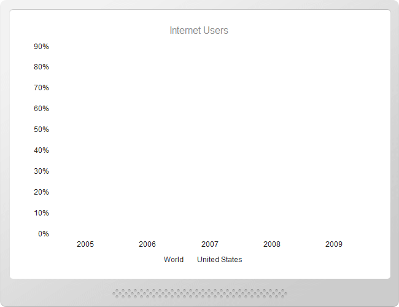
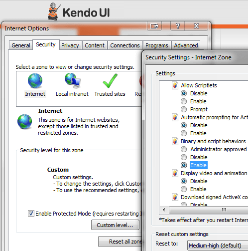

# Common Issues

This article provides solutions for issues you might encounter while working with the Kendo UI Charts for jQuery.

## Chart labels overlap after refresh in Internet Explorer

This limitation is browser-specific and is due to the lack of events that can be handled in regards to the font loading of the browser.

**Solution** To work around this issue, either:

* Delay the initialization of the Chart, or
* Add the [`@telerik/kendo-pack-fonts`](https://www.npmjs.com/package/@telerik/kendo-pack-fonts) module. For more information on how to implement this approach, refer to the article on [packing fonts for export]().

The following Dojo example demonstrates how to handle the issue by using `kendo-pack-fonts`. In Internet Explorer, open the implementation in full-screen mode.

```dojo
 <script src="https://cdn.rawgit.com/telerik/kendo-pack-fonts/8dc63142/sample/fonts.js"></script>
    <div id="example">
      <div class="demo-section k-content wide">
        <div id="chart"></div>
      </div>
       <script>
        function createChart() {
          $("#chart").kendoChart({
            title: {
              text: "Gross domestic product growth \n /GDP annual %/"
            },
            legend: {
              position: "bottom",
              labels: {
                font: "10px 'DejaVu Sans'"
              }
            },
            chartArea: {
              background: ""
            },
            seriesDefaults: {
              type: "line",
              style: "smooth"
            },
            series: [{
              name: "India Lorem ipsum dolor sit amet, consectetur adipisicing elit",
              data: [3.907, 7.943, 7.848, 9.284, 9.263, 9.801, 3.890, 8.238, 9.552, 6.855]
            },{
              name: "World Lorem ipsum dolor sit amet, consectetur adipisicing elit.",
              data: [1.988, 2.733, 3.994, 3.464, 4.001, 3.939, 1.333, -2.245, 4.339, 2.727]
            },{
              name: "Russian Federation Lorem ipsum dolor sit amet, consectetur adipisicing elit",
              data: [4.743, 7.295, 7.175, 6.376, 8.153, 8.535, 5.247, -7.832, 4.3, 4.3]
            },{
              name: "Haiti  Lorem ipsum dolor sit amet, consectetur adipisicing elits",
              data: [-0.253, 0.362, -3.519, 1.799, 2.252, 3.343, 0.843, 2.877, -5.416, 5.590]
            },{
              name: "Haiti  Lorem ipsum dolor sit amet, consectetur adipisicing elits",
              data: [-0.253, 0.362, -3.519, 1.799, 2.252, 3.343, 0.843, 2.877, -5.416, 5.590]
            },{
              name: "Haiti  Lorem ipsum dolor sit amet, consectetur adipisicing elits",
              data: [-0.253, 0.362, -3.519, 1.799, 2.252, 3.343, 0.843, 2.877, -5.416, 5.590]
            },{
              name: "Haiti  Lorem ipsum dolor sit amet, consectetur adipisicing elits",
              data: [-0.253, 0.362, -3.519, 1.799, 2.252, 3.343, 0.843, 2.877, -5.416, 5.590]
            },{
              name: "Haiti  Lorem ipsum dolor sit amet, consectetur adipisicing elits",
              data: [-0.253, 0.362, -3.519, 1.799, 2.252, 3.343, 0.843, 2.877, -5.416, 5.590]
            },{
              name: "Haiti  Lorem ipsum dolor sit amet, consectetur adipisicing elits",
              data: [-0.253, 0.362, -3.519, 1.799, 2.252, 3.343, 0.843, 2.877, -5.416, 5.590]
            }],
            valueAxis: {
              labels: {
                format: "{0}%"
              },
              line: {
                visible: false
              },
              axisCrossingValue: -10
            },
            categoryAxis: {
              categories: [2002, 2003, 2004, 2005, 2006, 2007, 2008, 2009, 2010, 2011],
              majorGridLines: {
                visible: false
              },
              labels: {
                rotation: "auto"
              }
            },
            tooltip: {
              visible:false
            }
          });
        }
        $(document).ready(createChart);
      </script>
    </div>
```

## Chart graphics do not render in Internet Explorer



> A security message which prompts you to enable the Intranet settings might appear. If you do so, skip the following steps.

**Solution** Select **Internet Options** > **Security** > **Internet** (or **Local intranet**) > **Custom Level**  and enable **Binary and script behaviors** by ticking the **Enable** radio button.



## The Chart does not render when JavaScript is disabled

The Kendo UI Chart widgets requires JavaScript to run.

**Solution** Enable JavaScript.

## The Chart does not render on mobile devices or tablets

The browser must support SVG as the below ones do:

1.  iOS Safari 3.2 and later versions
2.  Opera Mobile 10.0 and later versions
3.  Android 3.0 and later versions

## The layout of the Chart is different in the exported PDF files

Such issues are typically caused by the different fonts that are used on screen and in the PDF. For display, the browser will substitute the selected font with whatever is provided by the system. During export, you will take the metrics from the actual font in use and determine the PDF layout from that. It is likely that the resulting PDF will be displayed with a different font which leads to layout and encoding issues.

**Solution** [Make the fonts available for embedding](#configuration-custom). This means that the fonts have to be available as binary TTF files and registered for export which is demonstrated in the [PDF Export demo on Charts](https://demos.telerik.com/kendo-ui/pdf-export/index) as well.

The following example demonstrates how to embed fonts in exported PDF.

```dojo
<button class='export-pdf k-button'>Save as PDF</button>

<div id="chart"></div>

<script>
    // Import DejaVu Sans font for embedding

    kendo.pdf.defineFont({
        "DejaVu Sans"             : "https://kendo.cdn.telerik.com/{{ site.cdnVersion }}/styles/fonts/DejaVu/DejaVuSans.ttf",
        "DejaVu Sans|Bold"        : "https://kendo.cdn.telerik.com/{{ site.cdnVersion }}/styles/fonts/DejaVu/DejaVuSans-Bold.ttf",
        "DejaVu Sans|Bold|Italic" : "https://kendo.cdn.telerik.com/{{ site.cdnVersion }}/styles/fonts/DejaVu/DejaVuSans-Oblique.ttf",
        "DejaVu Sans|Italic"      : "https://kendo.cdn.telerik.com/{{ site.cdnVersion }}/styles/fonts/DejaVu/DejaVuSans-Oblique.ttf"
    });
</script>

<!-- Load Pako ZLIB library to enable PDF compression -->
<script src="//kendo.cdn.telerik.com/{{ site.cdnVersion }}/js/pako_deflate.min.js"></script>

<script>
     $(".export-pdf").click(function() {
         $("#chart").getKendoChart().saveAsPDF();
     });

     $("#chart").kendoChart({
        pdf: {
            fileName: "Kendo UI Chart Export.pdf",
            proxyURL: "https://demos.telerik.com/kendo-ui/service/export"
        },
        title: {
            text: "Gross domestic product growth \n /GDP annual %/",
            font: "bold 16px 'DejaVu Sans'"
        },
        legend: {
            position: "bottom"
        },
        seriesDefaults: {
            type: "area",
            area: {
                line: {
                    style: "smooth"
                }
            }
        },
        series: [{
            name: "India",
            data: [3.907, 7.943, 7.848, 9.284, 9.263, 9.801, 3.890, 8.238, 9.552, 6.855]
        }, {
            name: "World",
            data: [1.988, 2.733, 3.994, 3.464, 4.001, 3.939, 1.333, -2.245, 4.339, 2.727]
        }]
    });
</script>
```

## See Also

* [Themes and Appearance of the Kendo UI Widgets]()
* [Rendering Modes for Data Visualization]()
* [Performance Issues in Kendo UI Widgets for Data Visualization]()
* [Common Issues in Kendo UI]()
* [Kendo UI JavaScript Errors]()
* [Kendo UI Performance Issues]()
