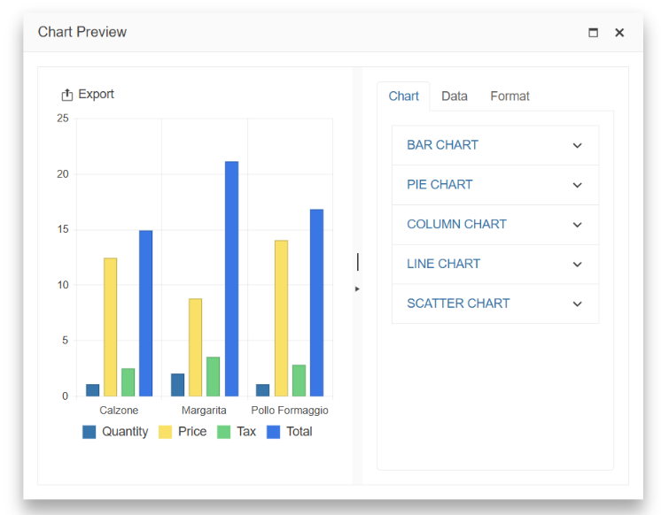

# {{ site.product }} ChartWizard Overview

The ChartWizard lets you create a chart using data from a Grid, another data-bound component, or an external source. The Chart Wizard has a simple interface that allows you to set up the chart type, series, axes, data source, and more.

## Functionality and Features

* [Data Binding]()&mdash;You can configure the ChartWizard data.
* [Export Options]()&mdash;The ChartWizard allows you to export the Chart in different file formats.
* [Window Configuration]()&mdash;You can configure the ChartWizard window options.
* [Accessibility]()&mdash;The ChartWizard is accessible for screen readers, supports WAI-ARIA attributes, and delivers keyboard shortcuts for faster navigation.

## Next Steps 

* [Getting Started with the Kendo UI ChartWizard for jQuery]()
* [Overview of the ChartWizard (Demo)](https://demos.telerik.com/kendo-ui/chartwizard/index)
* [JavaScript API Reference of the ChartWizard](/api/javascript/ui/chartwizard)

## See Also

* [Basic Usage of the ChartWizard (Demo)](https://demos.telerik.com/kendo-ui/chartwizard/index)
* [JavaScript API Reference of the ChartWizard](/api/javascript/ui/chartwizard)
