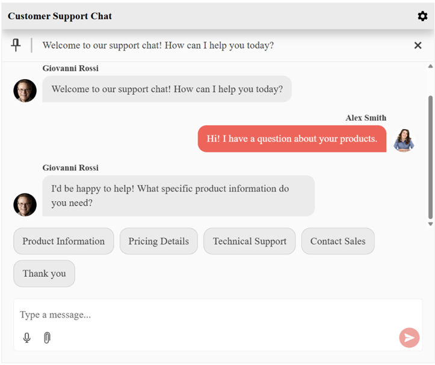

# {{ site.product }} Chat Overview

> Starting with the **2025.3.825** Kendo UI for jQuery version, the Chat component has been completely redesigned. The API is updated accordingly to support the newly introduced features.

The Kendo UI for jQuery Chat component empowers developers to create sophisticated conversational experiences within web applications. It facilitates seamless communication between users, chatbots, and AI-powered systems through an intuitive and highly customizable interface. The component offers extensive functionality including message threading, file attachments, user avatars, quick action suggestions, and comprehensive accessibility support. Built with flexibility in mind, it enables easy integration with various messaging services, machine learning models, and custom business workflows to meet diverse application requirements.

## Functionality and Features

* [Data Binding]()&mdash;Bind the Chat component either to a local data collection, to data retrieved from a remote endpoint.
* [AI Integration]()&mdash;Configure the Chat to interact with a large language model through a standalone AI chat client service.
* [Tools]()&mdash;Utilize the available context menu actions and toolbar and commands.
* [File Uploads and Media]()&mdash;Enable the file uploads, media sharing, and speech-to-text functionality of the Chat component.
* [Quick Actions]()&mdash;Define quick response suggestions that appear below the message input.
* [Templates]()&mdash;Use the template options to customize the rendering of the messages, attachments, and quick actions.

## Next Steps 

* [Getting Started with the Kendo UI Chat for jQuery]()
* [Overview of the Chat (Demo)](https://demos.telerik.com/kendo-ui/chat/index)
* [JavaScript API Reference of the Chat](/api/javascript/ui/chat)

## See Also

* [Basic Usage of the Chat (Demo)](https://demos.telerik.com/kendo-ui/chat/index)
* [JavaScript API Reference of the Chat](/api/javascript/ui/chat)
