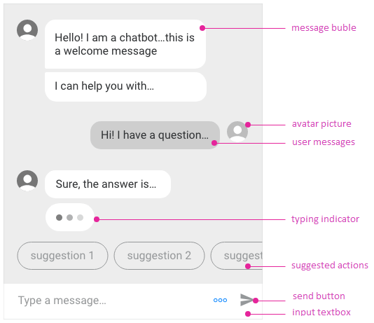

# {{ site.product }} Chat Overview

The Chat allows the user to participate in chat sessions with other users or with chat bots.

Chats provide support for default cards and actions, and enable the configuration of custom templates and custom components. They provide rich conversational experience that goes beyond the natural language understanding and personality of the chatbot. These features allow you to implement conversational UI in your applications by utilizing AI-powered frameworks that work with natural language processing either by following a predefined logical tree or for integrating P2P chat capabilities in the applications.

## Functionality and Features

* [Items]()&mdash;The Chat component supports predefined and customizable items.
* [Toolbar]()&mdash;You can customize the tools displayed in the Chat`s toolbar.
* [Peer-to-Peer Chat with SignalR]()&mdash;You can configure a Kendo UI Chat component and a .Net Core SignalR service to create a Peer-to-Peer Chat application.
* [Chat Bot service integration]()&mdash;The Chat allows you to connect to any remote service that can return content to the component.
* [Microsoft Bot Framework integration]()&mdash;You can configure a `Chat agent class` that handles the communication between the Chat component and the `Microsoft Bot Framework`.
* [Google DialogFlow integration]()&mdash;You can configure a `Chat agent class` that handles the communication between the Chat component and the `Google DialogFlow`.

## Next Steps 

* [Getting Started with the Kendo UI Chat for jQuery]()
* [Overview of the Chat (Demo)](https://demos.telerik.com/kendo-ui/chat/index)
* [JavaScript API Reference of the Chat](/api/javascript/ui/chat)

## See Also

* [Basic Usage of the Chat (Demo)](https://demos.telerik.com/kendo-ui/chat/index)
* [JavaScript API Reference of the Chat](/api/javascript/ui/chat)
