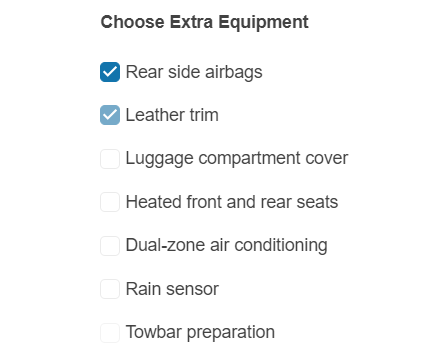

# {{ site.product }} CheckBox Overview

The CheckBox allows you to provide checkbox functionality to `<input />` elements, style them, set an encoded or decoded label, and disable the CheckBox.

## Functionality and Features

* [Appearance]()
* [Label]()

## Next Steps 

* [Getting Started with the Kendo UI CheckBox for jQuery]()
* [Overview of the CheckBox (Demo)](https://demos.telerik.com/kendo-ui/checkbox/index)
* [JavaScript API Reference of the CheckBox](/api/javascript/ui/checkbox)

## See Also

* [Overview of the CheckBox (Demo)](https://demos.telerik.com/kendo-ui/checkbox/index)
* [JavaScript API Reference of the CheckBox](/api/javascript/ui/checkbox)
