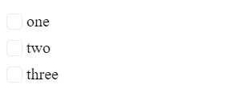

# {{ site.product }} CheckBoxGroup Overview

The CheckBoxGroup allows you to style and provide checkbox functionality to list elements and set the position of the labels, attributes, and custom CSS classes.

## Functionality and Features

* [Binding]()&mdash;Allows you to configure the CheckBoxGroup items.
* [Label]()&mdash;The CheckBoxGroup renders a label for each checkbox element.
* [Layout]()&mdash;Allows you to control the orientation of the CheckBoxGroup.
* [Accessibility]()&mdash;The CheckBoxGroup is accessible for screen readers, supports WAI-ARIA attributes, and delivers keyboard shortcuts for faster navigation.

## Next Steps 

* [Getting Started with the Kendo UI CheckBoxGroup for jQuery]()
* [Overview of the CheckBoxGroup (Demo)](https://demos.telerik.com/kendo-ui/checkboxgroup/index)
* [JavaScript API Reference of the CheckBoxGroup](/api/javascript/ui/checkboxgroup)

## See Also

* [Basic Usage of the CheckBoxGroup (Demo)](https://demos.telerik.com/kendo-ui/checkboxgroup/index)
* [JavaScript API Reference of the CheckBoxGroup](/api/javascript/ui/checkboxgroup)
