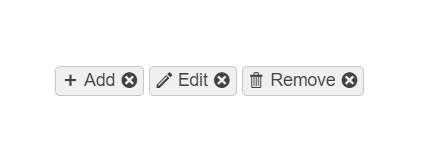

# ChipList Overview

The  ChipList allows you to maintain a set of selected chips.

The ChipList is a container for two or more individual Chip components. They represent a complex piece of information in a compact form—for example, an entity that can be a person, a place, or a thing. Each chip from the list can be selected or removed and supports various styling options. The ChipList component is commonly used for single or multiple selections such as additions to an ordered meal.

## Functionality and Features

* [Selection mode]()&mdash;You can set the selection mode of the ChipList by using the available configuration options.
* [Customization]()&mdash;Allows you to specify icons for the chip item's content.
* [Appearance]()—The ChipList delivers ready-to-use, predefined sets of styling options.

## Next Steps

* [Getting Started with the Kendo UI ChipList for jQuery]()
* [Basic Usage of the ChipList (Demo)](https://demos.telerik.com/kendo-ui/chiplist/index)
* [JavaScript API Reference of the ChipList](/api/javascript/ui/chiplist)

## See Also

* [Binding the ChipList over MVVM (Demo)](https://demos.telerik.com/kendo-ui/chiplist/mvvm)
* [Applying the ChipList API (Demo)](https://demos.telerik.com/kendo-ui/chiplist/api)
* [Basic Events in the ChipList (Demo)](https://demos.telerik.com/kendo-ui/chiplist/events)

