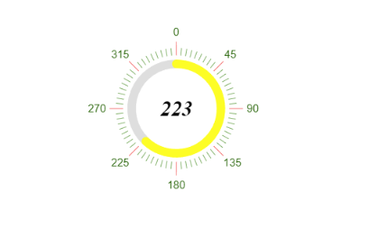

# {{ site.product }} CircularGauge Overview

The CircularGauge represents a value on a circular scale. It allows you to visualize numeric values in an attractive manner that matches the other widgets on the page.

The widget supports full customization of the Center Text, as well as, rich Scale and Color capabilities.

All graphics render on the client by using the [Scalable Vector Graphics (SVG)](https://en.wikipedia.org/wiki/Scalable_Vector_Graphics) format.

## Functionality and Features

* [Color ranges]()—The CircularGauge allows you to set different colors per each range.
* [Scale options]()—The CircularGauge provides an option to customize the scale appearance, by setting labels, ticks, background color, etc.
* [Templates]()—You can use templates to customize the content inside the center of the CircularGauge.

## Next Steps

* [Getting Started with the Kendo UI CircularGauge for jQuery]()
* [Basic Usage of the CircularGauge (Demo)](https://demos.telerik.com/kendo-ui/circular-gauge/index)
* [JavaScript API Reference of the CircularGauge](/api/javascript/dataviz/ui/circulargauge)

## See Also

* [Overview of the CircularGauge (Demo)](https://demos.telerik.com/kendo-ui/circular-gauge/index)
* [JavaScript API Reference of the CircularGauge](/api/javascript/dataviz/ui/circulargauge)
