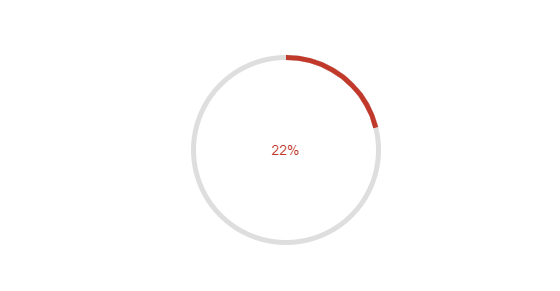

# {{ site.product }} CirularProgressbar Overview

The CircularProgressBar delivers functionality for displaying and tracking the progress of a task.

## Functionality and Features

* [Colors]()&mdash;You can change the colors based on the component's current value.
* [Modes]()&mdash;The CircularProgressBar exposes finite and infinite modes.

## Next Steps

* [Getting Started with the Kendo UI CircularProgressBar for jQuery]()
* [Overview of the CircularProgressBar (Demo)](https://demos.telerik.com/kendo-ui/circularprogressbar/index) 

## See Also
 
* [CircularProgressBar Basic Usage (Demo)](https://demos.telerik.com/kendo-ui/circularprogressbar/basic-usage)
* [Applying the CircularProgressBar API (Demo)](https://demos.telerik.com/kendo-ui/circularprogressbar/api)
* [JavaScript API Reference of the CircularProgressBar](/api/javascript/ui/circularprogressbar)
