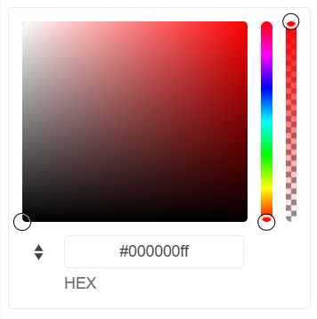

# {{ site.product }} ColorGradient Overview

The Kendo UI for jQuery ColorGradient renders a gradient (a hue and an alpha slider) and inputs to manually enter a desired color. You can directly add the widget to the page instead of rendering it in a popup.

## Functionality and Features

* [Contrast Tool]()&mdash;The widget provides a color contrast tool, which checks the contrast ratio between two colors.
* [Formats]()&mdash;The widget supports RGB and HEX input formats.
* [Accessibility]()&mdash;The ColorGradient supports various accessibility standards.

## Next Steps 

* [Getting Started with the Kendo UI ColorGradient for jQuery]()
* [Basic Usage of the ColorGradient (Demo)](https://demos.telerik.com/kendo-ui/colorgradient/index)
* [JavaScript API Reference of the ColorGradient](/api/javascript/ui/colorgradient)

## See Also

* [Overview of the ColorGradient (Demo)](https://demos.telerik.com/kendo-ui/colorgradient/index)
* [Using the API of the ColorGradient (Demo)](https://demos.telerik.com/kendo-ui/colorgradient/api)
* [JavaScript API Reference of the ColorPicker](/api/javascript/ui/colorgradient)
