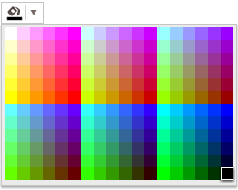

# Custom List of Colors

To display a custom list of colors in the ColorPicker, pass them in the `palette` argument. The following example demonstrates how to display the white, black, and red colors. You can render any other color by using its short (3 digits) or long (6 digits) HEX notation and by omitting the `#` sign.

```dojo
    <input type="color" id="myColorField" />

    <script>
        $(document).ready(function(){
            $("#myColorField").kendoColorPicker({
            	views:["palette"],
                preview:false,
                palette: "#fff,#000,#f00"
            });
        });
    </script>
```

The following example demonstrates how to create a web-safe color palette with 216 colors.

```dojo
    <input type="color" id="myColorField" />

    <script>
        $(document).ready(function(){
            $("#myColorField").kendoColorPicker({ 
            	views:["palette"],
              preview:false,
            	palette: "websafe" 
            });
        });
    </script>
```




>note As of the end of 2021, the ColorPicker has a new design. The configuration from the example below shows how to revert to the old design of the component:

```dojo
    <input id="picker" />
    <script>
        $("#picker").kendoColorPicker({
            input: false,
            preview:false,
            views: ["gradient"]
        });
    </script>
```

## See Also 

* [JavaScript API Reference of the ColorPicker](/api/javascript/ui/colorpicker)
* [Knowledge Base Section](/knowledge-base)
