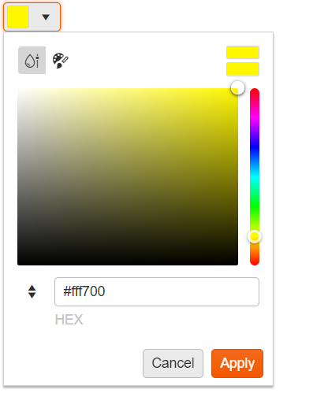

# {{ site.product }} ColorPicker Overview

The ColorPicker is a drop-down list for selecting colors.

It is designed to replace the HTML5 `<input type="color">` tag which is not supported in all browsers.

The default popup contains a gradient with HEX input.

You can also create a simple ColorPicker and render 20 colors.

## Functionality and Features

* [Appearance]()&mdash;The available styling options allow you to configure the component and change its appearance.
* [Contrast Tool]()&mdash;A tool for checking the color contrast ratio between two colors.
* [RGB and HEX Formats]()&mdash;The ColorPicker supports RGB and HEX formats.
* [Views]()&mdash;The component allows you to choose between a `gradient` and a `palette` view. 

## Next Steps 

* [Getting Started with the Kendo UI ColorPicker for jQuery]()
* [Overview of the ColorPicker (Demo)](https://demos.telerik.com/kendo-ui/colorpicker/index)
* [JavaScript API Reference of the ColorPicker](/api/javascript/ui/colorpicker)

## See Also

* [Basic Usage of the ColorPicker (Demo)](https://demos.telerik.com/kendo-ui/colorpicker/index)
* [Using the API of the ColorPicker (Demo)](https://demos.telerik.com/kendo-ui/colorpicker/api)
* [JavaScript API Reference of the ColorPicker](/api/javascript/ui/colorpicker)
