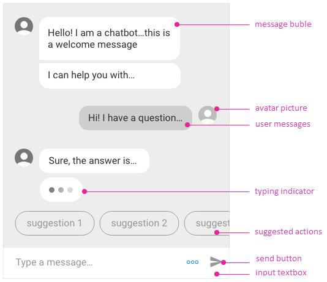

# Chat Overview

The [Kendo UI Chat](http://demos.telerik.com/kendo-ui/chat/index) widget allows the user to participate in chat sessions with other users or with chat bots.

The Chat provides rich conversational experience that goes beyond the natural language understanding and personality of your chatbot. These features allow you to implement conversational UI in your applications by utilizing AI-powered frameworks that work with natural language processing either by following a predefined logical tree or for integrating P2P chat capabilities in the applications.

 **Figure 1: Structure of the Chat widget**



## Getting Started

### Creating the Chat

1. Add an empty `div` to the HTML.
1. Provide it with an ID.
1. (Optional) Set the width and height of the desired chat inline or by using CSS.

```dojo
<div id="chat" style="width: 400px; height: 600px"></div>
```

### Initializing the Chat

1. Select the `div` with a jQuery selector.
1. Call the `kendoChat()` function.
1. Configure its implementation for the [`post`](/api/javascript/ui/chat/events/post) event.

```dojo
<div id="chat" style="width: 400px; height: 600px"></div>
<script>
	var chat = $("#chat").kendoChat({
		post: function (args) {
			// react on a user post action
		}
	}).data("kendoChat");
</script>
```

## Features

* [Items]()
* [Toolbar]()
* [Connecting to Chat Bot services]()
* [Connecting to Microsoft Bot Framework]()
* [Connecting to Google DialogFlow]()

## See Also

* [Chat Items]()
* [Connecting to Chat Bot Services]()
* [Connecting to Microsoft Bot Framework]()
* [Connecting to Google DialogFlow]()
* [Chat JavaScript API Reference](/api/javascript/ui/chat)

For runnable examples on Kendo UI Chat, refer to the [Kendo UI Demos site](http://demos.telerik.com/kendo-ui/chat/index).
