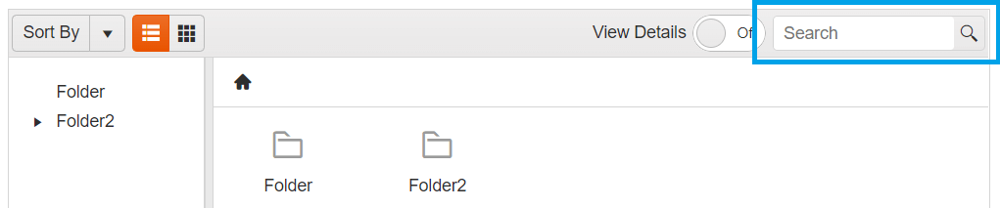

# Search in FileManager

The FileManager provides an inbuilt Search functionality, allowing you to find the specific file in the currently selected folder. 

**Inbuilt Search textbox in FileManager:** 

## See Also

* [Overview of Kendo UI FileManager]()
* [Sort in Kendo UI FileManager]()
* [Toolbar Commands in Kendo UI FileManager]()

