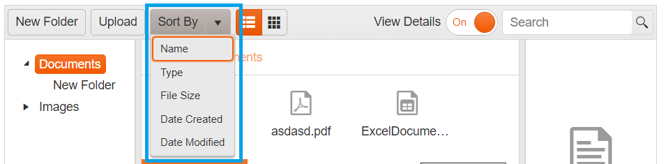

# Sort  

The FileManager provides an inbuilt Sort functionality, allowing you to sort the files and folders in the currently selected folder. 

The tool from the toolbar exposes several options to sort by:

* Name
* Type (extension)
* File Size
* Date Created
* Date Modified

**Inbuilt Sort  functionality in FileManager:** 

## See Also

* [Overview of Kendo UI FileManager]()
* [Views in Kendo UI FileManager]()
* [Navigation in Kendo UI FileManager]()
