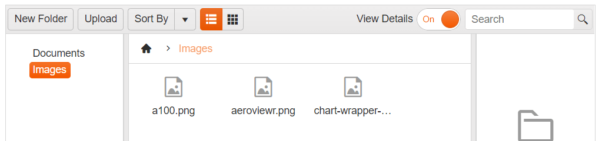

# Toolbar Commands

The FileManager component contains a nested Kendo Toolbar component.

The toolbar has a predefined set of tools which you can show or hide, depending on your preferences and business scenario. By default, the toolbar contains the following tools:

* *New Folder* button, allowing you to create new folders in the current location.
* *Upload Button* prompting you with a window to upload files.
* *Sort By* dropdown, allowing you to sort by a number of predicates
* *Views* button group to control 
* *View Details* switch button to toggle the Preview Pane visibility
* *Search* textbox to filter the content

**Inbuilt Sort  functionality in FileManager:** 


## Customizing the Toolbar Commands

To enable/disable a Toolbar command button or update the its text you can use the  `toolbar.items` configuration option:
```
    toolbar: {
        items: [
            { type:"button", text:"Create Folder custom name", enable:false, command:"CreateFolderCommand" },
        ]
    }
```

## Adding Custom Commands to the Toolbar

As of Kendo UI R1 2020 SP1 the kendo.ui.filemanager namespace exposes the FileManagerCommand class that could be extended to implement a custom FileManager command. The example below demonstrates how to create a custom command that shows the total size of the selected files.
```dojo
    <div id="filemanager"></div>

    <script>
      $("#filemanager").kendoFileManager({
        dataSource: {
          schema: kendo.data.schemas.filemanager,
          transport: {
            read: {
              url: "/kendo-ui/service/FileManager/Read",
              method: "POST"
            },
            create: {
              url: "/kendo-ui/service/FileManager/Create",
              method: "POST"
            },
            update: {
              url: "/kendo-ui/service/FileManager/Update",
              method: "POST"
            },
            destroy: {
              url: "/kendo-ui/service/FileManager/Destroy",
              method: "POST"
            }
          }
        },
        uploadUrl: "/kendo-ui/service/FileManager/Upload",
        toolbar: {
          items: [
            { name: "createFolder" },
            { name: "upload" },
            { name: "custom", type: "button", text: "Get Info", command: "MyCustomCommand" },
            { name: "sortDirection" },
            { name: "sortField" },
            { name: "changeView" },
            { name: "spacer" },
            { name: "details" },
            { name: "search" }
          ]
        },
        contextMenu: {
          items: [
            { name: "rename" },
            { name: "delete" },
            { name: "custom", text: "Get Info", command: "MyCustomCommand", spriteCssClass:"k-icon k-i-info" }
          ]
        },
        draggable: true,
        resizable: true
      });

      $(document).ready(function () {

        var filemanagerNS = kendo.ui.filemanager;

        filemanagerNS.commands.MyCustomCommand = filemanagerNS.FileManagerCommand.extend({
          exec: function(){
            var that = this,
                filemanager = that.filemanager,
                options = that.options, 
                target = options.target,
                selectedFiles = filemanager.getSelected(); 
            var totalSize = 0;
            selectedFiles.forEach(function(fileEntry){
              totalSize += fileEntry.size;
            });

            kendo.alert('Selected files size: ' + kendo.getFileSizeMessage(totalSize))
          }
        });
      })
    </script>

```

## See Also

* [Overview of Kendo UI FileManager]()
* [ContextMenu in Kendo UI FileManager]()
* [Drag and Drop in Kendo UI FileManager]()
