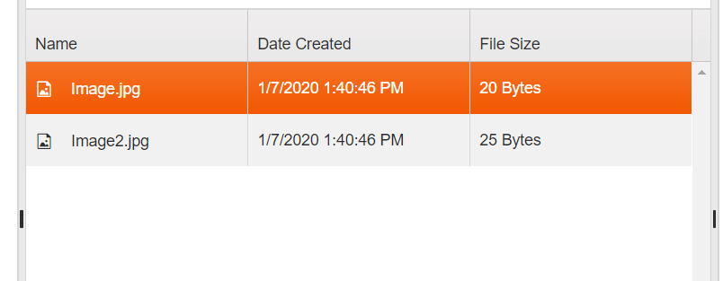
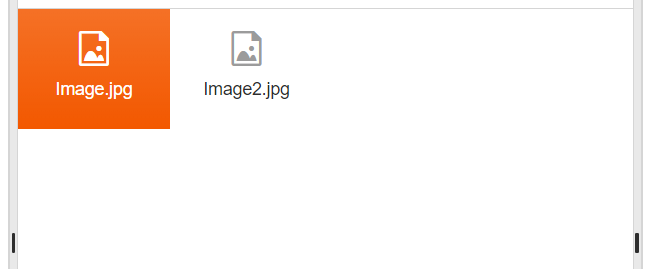

# Views Overview

The FileManager provides two inbuilt views for content visualization: `Grid` and `List` Views.  

You can switch between views from the Toolbar button group

## Grid View
This view is achieved with the Kendo Grid and in renders the files in a tabular manner (see Image1 below). That said, you can control the configuration of this view trough the `views.grid` object of the FileManager (see example below). 

```js
    $("#filemanager").kendoFileManager({
        views: {
            grid: {
                sortable: false //disable the sorting of the grid
            }
        },
        dataSource: {
            schema: kendo.data.schemas.filemanager,
            data: data //local binding
        }
    });
```

**GridView type in FileManager:**



## List View (Thumbnails)

The List view is implemented with the help of the Kendo ListView component. The content in this view is rendered as a list of thumbnails, representing the files. You can control the configuration of this view trough the `views.list` object of the FileManager. 

```js
    $("#filemanager").kendoFileManager({
        views: {
            list: {
               ... //disable the sorting of the grid
            }
        },
        dataSource: {
            schema: kendo.data.schemas.filemanager,
            data: data //local binding
        }
    });
```
**ListView type in FileManager:** 



## See Also

* [ContextMenu in Kendo UI FileManager]()
* [Drag and Drop in Kendo UI FileManager]()
