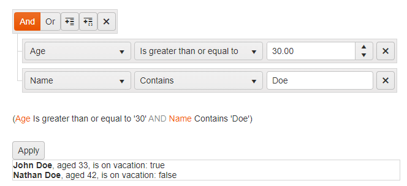

# Filter Overview

The [Kendo UI Filter widget](https://demos.telerik.com/kendo-ui/filter/index) a unified control for filtering data-bound components that have a [data source](/api/javascript/data/datasource).

The user interface of the Filter is useful for data-bound components that do not have a built-in UI for filtering but are required to provide filter options&mdash;for example, the ListView, Chart, and Scheduler. You can add or remove the fields by which the data will be filtered and select the global logic of the filters (`AND` or `OR`) and the filter operator for each field (for example, `contains` or `equals`). You can apply the filtering through a built-in button or through an API call. You can also select the name by which the fields will be displayed to the user and [localize]() the filter operators and messages.

* [Demo page for the Filter](https://demos.telerik.com/kendo-ui/filter/index)



## Initializing the Filter

To use the Filter, use an empty `div` element and supply its settings in the initialization script.

The following example demonstrates how to:
* Tie a filter to a data source.
* Display the filtered data in a list view.
* Use human-readable names for the fields.
* Set an initial [filter expression](/api/javascript/ui/filter/configuration/expression).

> * You can use a remote data source instead of an array of local data. The local array is used for brevity in this example.
> * Providing the fields is not required because the Filter can extract them from the data source. If you do not set the fields in the filter settings, the actual field names, and not the human-readable `label`, will be displayed to the user. If you set the fields in the filter settings, they must match the schema of the data source.
> * Providing an initial filter expression is not required. This feature is useful for [restoring previous states]().

```dojo
<div id="filter"></div>
<ul id="listView"></ul>

<script type="text/x-kendo-template" id="item">
    <li>
        <strong>#= name #</strong>, aged #= age #, is on vacation: #= isOnLeave #
    </li>
</script>

<script>
    $(document).ready(function () {
        var dataSource = new kendo.data.DataSource({
            data: [
                { name: "Jane Doe", age: "25", isOnLeave: false },
                { name: "John Doe", age: "33", isOnLeave: true },
                { name: "John Smith", age: "37", isOnLeave: true },
                { name: "Nathan Doe", age: 42, isOnLeave: false }
            ],
            schema: {
                model: {
                    fields: {
                        name: { type: "string" },
                        age: { type: "number" },
                        isOnLeave: { type: "boolean" }
                    }
                }
            }
        });

        $("#filter").kendoFilter({
            dataSource: dataSource,
            expressionPreview: true, // Shows a text preview of the filter expression.
            applyButton: true, // Shows the built-in Apply button.
            fields: [ // Defining the fields is not mandatory. Otherwise, they will be taken from the data source schema.
                    // If you define the fields, their names and types must match the data source definition.
                { name: "name", type: "string", label: "Name" },
                { name: "age", type: "number", label: "Age" },
                { name: "isOnLeave", type: "boolean", label: "On Vacation" }
            ],
            expression: { // Defining an initial filter expression is not required.
                logic: "and",
                filters: [
                    { field: "age", value: 30, operator: "gte" },
                    { field: "name", value: "Doe", operator: "contains" }
                ]
            }
        }).data("kendoFilter").applyFilter();
        // Chain the method call to immediately apply filtering after the widget initialization because an initial filter is set.

        $("#listView").kendoListView({
            dataSource: dataSource,
            template: kendo.template($("#item").html())
        });
    });
</script>
```

## Functionality and Features

* [Setting the operators]()
* [Persisting the state]()
* [Globalization]()

## Events

You can subscribe to all [Filter events](/api/javascript/ui/filter#events).

## Referencing Existing Instances

To refer to an existing Filter instance use the `jQuery.data()` method. Once a reference is established, use the [Filter API](/api/javascript/ui/filter) to control its behavior.

```
var filter = $("#theFilter").data("kendoFilter");
```

## See Also

* [Basic Usage of the Filter (Demo)](https://demos.telerik.com/kendo-ui/filter/index)
* [MVVM Binding by the Filter (Demo)](https://demos.telerik.com/kendo-ui/filter/mvvm)
* [Using the Editor Template in the Filter (Demo)](https://demos.telerik.com/kendo-ui/filter/custom-editors)
* [Persisting the State of the Filter (Demo)](https://demos.telerik.com/kendo-ui/filter/persist-state)
* [JavaScript API Reference of the Filter](/api/javascript/ui/filter)
