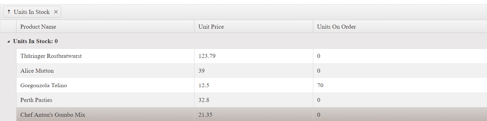
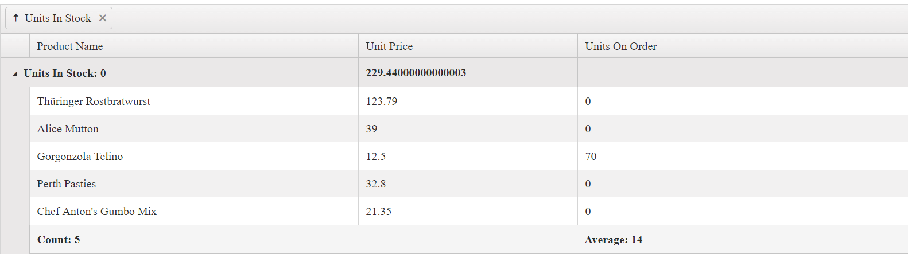
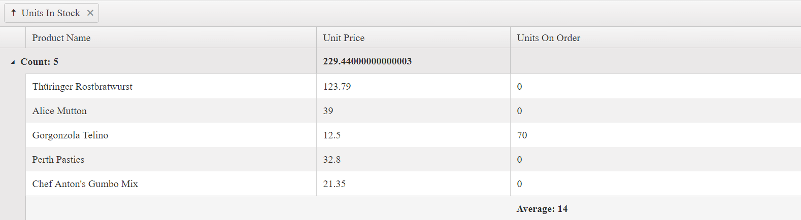

# Group Templates

When grouping is applied, the group rows of the Grid organize data rows into a tree structure.

For runnable examples, refer to:
* [Demo on using the row template of the Grid](https://demos.telerik.com/kendo-ui/grid/rowtemplate)
* [Demo on using the detail-row template of the Grid](https://demos.telerik.com/kendo-ui/grid/detailtemplate)
* [Demo on using the toolbar template of the Grid](https://demos.telerik.com/kendo-ui/grid/toolbar-template)

Group rows display group summary values and contain expanding and collapsing group icons which enable users to expand (show the child rows) and collapse (hide the child rows) a group row. The Grid provides the following templates which you can use to customize the appearance of the group rows:
- [`GroupHeaderTemplate`](https://docs.telerik.com/kendo-ui/api/javascript/ui/grid/configuration/columns.groupheadertemplate)&mdash;Renders a template for the entire group row. Usually, the main aim is to display information about the entire group. By default, if you do not define a template, the name of the field and the current group value is displayed.
- (Available as of the R3 2018 release) [`GroupHeaderColumnTemplate`](https://docs.telerik.com/kendo-ui/api/javascript/ui/grid/configuration/columns.groupheadercolumntemplate)&mdash;Renders a template in the group row aligned to the column itself. Usually, it displays an aggregate value for a specific column in the context of the current group. The template content is visually displayed as aligned to the column itself.
- [`GroupFooterTemplate`](https://docs.telerik.com/kendo-ui/api/javascript/ui/grid/configuration/columns.groupfootertemplate)&mdash;Renders a template in the group footer row that is aligned to the column. Works in a similar way to the `groupHeaderColumnTemplate` for the group footer row.

If you do not define a template, the name of the field and the current group are displayed in the following way.

**Figure 1: A Grid with no group templates**

The only difference in the use of `GroupHeaderTemplate` is that the template content is compiled and displayed instead of the field and current group value. Both `GroupHeaderColumnTemplate` and `GroupFooterTemplate` work in a similar way. `GroupHeaderColumnTemplate` displays the content as aligned to the column in the group row. `GroupFooterTemplate` displays the content as aligned to the column in the group footer row. Their content is displayed as aligned to the column as shown in the following way.

**Figure 1: A Grid with defined group header and group footer templates**

Because `GroupHeaderTemplate` is displayed next to the expanding icon of the group row, it takes precedence over the `GroupHeaderColumnTemplate` of the first visible column. To show the `GroupHeaderColumnTemplate` content for the first column of the Grid, do not set the `GroupHeaderTemplate` for the group column. The following Grid configuration demonstrates that commenting the `GroupHeaderTemplate` for the **Units In Stock** column shows the `GroupHeaderColumnTemplate` for the **Product Name** column.

#### Example

    

    

**Figure 2: A Grid with a group header template applied to the first column and no group header template defined**

## See Also

* [Using Row Templates in the Grid (Demo)](https://demos.telerik.com/kendo-ui/grid/rowtemplate)
* [Using Detail-Row Templates in the Grid (Demo)](https://demos.telerik.com/kendo-ui/grid/detailtemplate)
* [Using Toolbar Templates in the Grid (Demo)](https://demos.telerik.com/kendo-ui/grid/toolbar-template)
* [JavaScript API Reference of the Grid](/api/javascript/ui/grid)
