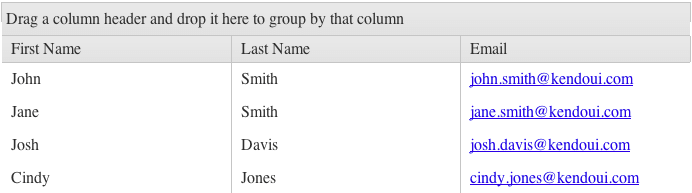

# Row Templates

The Kendo UI Grid supports row templates which enable you to place custom content into a Grid row.

For runnable examples, refer to:
* [Demo on using the row template of the Grid](https://demos.telerik.com/kendo-ui/grid/rowtemplate)
* [Demo on using the detail-row template of the Grid](https://demos.telerik.com/kendo-ui/grid/detailtemplate)
* [Demo on using the toolbar template of the Grid](https://demos.telerik.com/kendo-ui/grid/toolbar-template)

If you initialize the Grid from a `<div>` element, you can format any cell within the Grid by using templates within a `script` tag or within the `template` option on the column object.

The following example demonstrates how to use a template for formatting the email address as a hyperlink through a template declared in a `script` block.

    <script id="template" type="text/x-kendo-tmpl">
        <tr>
            <td>
                #= firstName #
            </td>
            <td>
                #= lastName #
            </td>
            <td>
                <a href="mailto:#= email #">#= email #</a>
            </td>
        </tr>
    </script>

The following example demonstrates how to specify the previous approach as a template for each row by passing it in to the `rowTemplate` option and by initializing it with the `kendo.template` function. As a result, the email address is an interactive hyperlink which opens a new email message when the user clicks it.

    $("#grid").kendoGrid({
        rowTemplate: kendo.template($("#template").html()),
       // Other configuration.
    });

**Figure 1: A Grid with an applied row template**



## Using Row Templates with Detail Templates

A few requirements need to be met when the `rowTemplate` is used alongside a `detailTemplate`.

1. The `<tr>` element of the `rowTemplate` needs to have a class `k-master-row`.
1. The first `<td>` element of the `rowTemplate` needs to have a class `k-hierarchy-cell`.
1. The element with class `k-hierarchy-cell` needs to contain an `a` element which will expand the row.

**Define the `rowTemplate` as an external template.**

```dojo
    <script id="template" type="text/x-kendo-template">
        <tr class="k-master-row" data-uid="#= uid #">
        		<td class="k-hierarchy-cell">
            	<a class="k-icon k-i-expand" href="\#" aria-label="Expand"></a>
      			</td>
            <td>
                <strong>#: name #</strong>
            </td>
            <td>
            	<strong>#: age #</strong>
            </td>
        </tr>
    </script>
  
    <script id="detail-template" type="text/x-kendo-template">
      <div>
        Name: #: name #
      </div>
      <div>
        Age: #: age #
      </div>
    </script>
    <div id="grid"></div>
    <script>
    $("#grid").kendoGrid({
      columns: [
        { field: "name" },
        { field: "age" }
      ],
      dataSource: [
        { name: "Jane Doe", age: 30 },
        { name: "John Doe", age: 33 }
      ],
      detailTemplate: kendo.template($("#detail-template").html()),
      rowTemplate: kendo.template($("#template").html())
    });
    </script>
```

**Define the `rowTemplate` as a function.**

```dojo
    <script id="detail-template" type="text/x-kendo-template">
      <div>
        Name: #: name #
      </div>
      <div>
        Age: #: age #
      </div>
    </script>
    <div id="grid"></div>
    <script>
      $("#grid").kendoGrid({
        columns: [
          { field: "name" },
          { field: "age" }
        ],
        dataSource: [
          { name: "Jane Doe", age: 30 },
          { name: "John Doe", age: 33 }
        ],
        detailTemplate: kendo.template($("#detail-template").html()),
        rowTemplate: rowTemplate
      });
      
      function rowTemplate(data) {
        return '<tr class="k-master-row" data-uid="' + data.uid + '"><td class="k-hierarchy-cell"><a class="k-icon k-i-expand" href="\#" aria-label="Expand"></a></td><td><strong>' + data.name + '</strong></td><td><strong>' + data.age + '</strong></td></tr>';
      }
    </script>
```

## KB Articles on Row Templates

* [Adding Row Numbers]()
* [Using Dates inside the Row Template]()
* [Find Out More in the Knowledge Base](/knowledge-base)

## See Also

* [Using Row Templates in the Grid (Demo)](https://demos.telerik.com/kendo-ui/grid/rowtemplate)
* [Using Detail-Row Templates in the Grid (Demo)](https://demos.telerik.com/kendo-ui/grid/detailtemplate)
* [Using Toolbar Templates in the Grid (Demo)](https://demos.telerik.com/kendo-ui/grid/toolbar-template)
* [Introduction on Templates]()
* [JavaScript API Reference of the Grid](/api/javascript/ui/grid)
