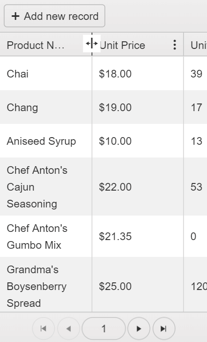

# Adaptive Rendering

The Kendo UI Grid for jQuery provides consistency to the customer experience on any device by supporting adaptive enhancements.

For example, when you filter or edit data on mobile, Kendo UI slides in a new screen for the user, which is a departure from the desktop-like inline and popup behaviors. To see these features in action, refer to the [adaptive rendering demo](https://demos.telerik.com/kendo-ui/grid/adaptive-rendering).

## Enabling Responsive Design

To enable the adaptive rendering feature, set the [`mobile`](/api/javascript/ui/grid/configuration/mobile) property to `true` or `phone`.

###### Example

    

    

## Configuring Panes on Mobile

The Pane in which the adaptive Grid is placed does not automatically expand its height. Thus, define an explicit pixel Grid height.

The following example demonstrates how to apply the `height` option.

###### Example

    

    

### Resizing of Columns

The column resizing feature on touch screen devices is triggered when the user holds a finger on the respective column header. When the resizing icon appears, the user can resize the column by dragging.

**Figure 1: A Grid with resizable columns on a mobile device**

## Destroying Adaptive Grids

When in adaptive mode, the Grid generates auxiliary markup which needs to be removed if the widget is to be [destroyed]() manually.

To manually destroy the Grid:

1. Call [`kendo.destroy()`](/api/javascript/kendo/methods/destroy) over the closest `.k-pane-wrapper` ancestor which is created around the Grid widget.
1. Remove the whole `.k-pane-wrapper` element from the DOM.

To recreate the Grid, insert a new `
` at the same place where the previous Grid `
` was initially placed.

## See Also

* [Implementing Responsive Columns in the Grid (Demo)](https://demos.telerik.com/kendo-ui/grid/responsive-columns)
* [JavaScript API Reference of the Grid](/api/javascript/ui/grid)
* [Kendo UI Knowledge Base](/knowledge-base)
