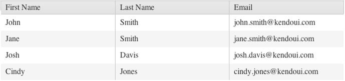

# Local Data

The Kendo UI Grid enables you to bind it to local arrays of data.

To bind the Grid to local data, set the `dataSource` option of the `kendoGrid` object.

###### Example

    var people = [ { firstName: "John",
                     lastName: "Smith",
                     email: "john.smith@telerik.com" },
                   { firstName: "Jane",
                     lastName: "Smith",
                     email: "jane.smith@telerik.com" },
                   { firstName: "Josh",
                     lastName: "Davis",
                     email: "josh.davis@telerik.com" },
                   { firstName: "Cindy",
                     lastName: "Jones",
                     email: "cindy.jones@telerik.com" } ];

     $("#grid").kendoGrid({
         dataSource: people
     });

**Figure 1: A Grid that is bound to a local data array**

## See Also

* [Local Data Binding of the Grid (Demo)](https://demos.telerik.com/kendo-ui/grid/local-data-binding)
* [JavaScript API Reference of the Grid](/api/javascript/ui/grid)
* [Knowledge Base Section](/knowledge-base)
