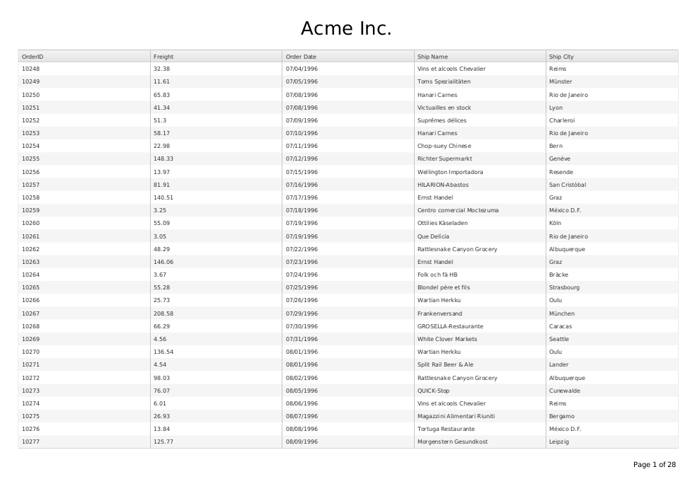

# Fit Grid on Page

It is possible to scale the Grid to fit to the page during [its PDF export]().

The example below applies the [`pdfExport` event](/api/javascript/ui/grid#events-pdfExport) to let you obtain a reference to the content of each exported page, scale and center it. It also shows you how to add a header and a footer that are not part of the original content. Both results are achieved by the usage of the primitives and helpers provided by the [Drawing API]().

**Figure 1. The Grid as configured to fit on the page during PDF export**



The example below demonstrates how to scale and modify the Grid content during PDF export.

###### Example

```html
<!-- Load Pako ZLIB library to enable PDF compression -->
<script src="http://kendo.cdn.telerik.com/2015.1.429/js/pako_deflate.min.js"></script>

<script>
  // Import DejaVu Sans font for embedding

  // NOTE: Only required if the Kendo UI stylesheets are loaded
  // from a different origin, e.g. kendo.cdn.telerik.com
  kendo.pdf.defineFont({
    "DejaVu Sans"             : "http://kendo.cdn.telerik.com/2014.3.1314/styles/fonts/DejaVu/DejaVuSans.ttf",
    "DejaVu Sans|Bold"        : "http://kendo.cdn.telerik.com/2014.3.1314/styles/fonts/DejaVu/DejaVuSans-Bold.ttf",
    "DejaVu Sans|Bold|Italic" : "http://kendo.cdn.telerik.com/2014.3.1314/styles/fonts/DejaVu/DejaVuSans-Oblique.ttf",
    "DejaVu Sans|Italic"      : "http://kendo.cdn.telerik.com/2014.3.1314/styles/fonts/DejaVu/DejaVuSans-Oblique.ttf"
  });
</script>

<style>
  /*
  Use the DejaVu Sans font for display and embedding in the PDF file.
  The standard PDF fonts have no support for Unicode characters.
  */
  .k-grid {
    font-family: "DejaVu Sans", "Arial", sans-serif;
  }

  /* Hide the Grid header and pager during export */
  .k-pdf-export .k-grid-toolbar,
  .k-pdf-export .k-pager-wrap
  {
    display: none;
  }
</style>

<div id="grid"></div>
<script>
  $("#grid").kendoGrid({
    toolbar: ["pdf"],
    pdf: {
      allPages: true,
      fileName: "Kendo UI Grid Export.pdf",
      proxyURL: "http://demos.telerik.com/kendo-ui/service/export",
      paperSize: "A4",
      margin: "1cm",
      landscape: true
    },
    pdfExport: function(e) {
      e.promise.progress(function(e) {
        // Fired for each page
        // http://docs.telerik.com/kendo-ui/api/javascript/ui/grid#events-pdfExport
        e.page = formatPage(e);
      });
    },
    dataSource: {
      type: "odata",
      transport: {
        read: "http://demos.telerik.com/kendo-ui/service/Northwind.svc/Orders"
      },
      schema: {
        model: {
          fields: {
            OrderID: { type: "number" },
            Freight: { type: "number" },
            ShipName: { type: "string" },
            OrderDate: { type: "date" },
            ShipCity: { type: "string" }
          }
        }
      },
      pageSize: 30,
      serverPaging: true,
    },
    pageable: true,
    scrollable: true,
    height: 550,
    columns: [
      {
        field:"OrderID",
        filterable: false
      },
      "Freight",
      {
        field: "OrderDate",
        title: "Order Date",
        format: "{0:MM/dd/yyyy}"
      }, {
        field: "ShipName",
        title: "Ship Name"
      }, {
        field: "ShipCity",
        title: "Ship City"
      }
    ]
  });


  // Import Drawing API namespaces
  var draw = kendo.drawing;
  var geom = kendo.geometry;

  // See
  // http://docs.telerik.com/kendo-ui/framework/drawing/drawing-dom#dimensions-and-css-units-for-pdf-output
  function mm(val) {
    return val * 2.8347;
  }

  // A4 Sheet with 1 cm borders, landscape
  var PAGE_RECT = new geom.Rect(
    [mm(0), 0], [mm(297 - 20), mm(210 - 20)]
  );

  // Spacing between header, content and footer
  var LINE_SPACING = mm(5);

  var scale;

  function formatPage(e) {
    var header = createHeader();
    var content = e.page;
    var footer = createFooter(e.pageNumber, e.totalPages);

    // Remove header, footer and spacers from the page size
    var contentRect = PAGE_RECT.clone();
    contentRect.size.height -= header.bbox().height() + footer.bbox().height() + 2 * LINE_SPACING;

    if(!scale){
    	// Fit the content in the available space
    	draw.fit(content, contentRect);
    	scale = content.transform().matrix().a;
    }
    else {
    	content.transform(kendo.geometry.transform().scale(scale));
    }

    // Do a final layout with content
    var page = new draw.Layout(PAGE_RECT, {
      // "Rows" go below each other
      orientation: "vertical",

      // Center rows relative to each other
      alignItems: "center",

      // Center the content block horizontally
      alignContent: "center",

      // Leave spacing between rows
      spacing: LINE_SPACING
    });
    page.append(header, content);
    page.reflow();

    // Move the footer to the bottom-right corner
    page.append(footer);
    draw.vAlign([footer], PAGE_RECT, "end");
    draw.align([footer], PAGE_RECT, "end");

    return page;
  }

  function createHeader() {
    return new kendo.drawing.Text("Acme Inc.", [0, 0], {
      font: mm(8) + "px 'DejaVu Sans'"
    });
  }

  function createFooter(page, total) {
    return new kendo.drawing.Text(
      kendo.format("Page {0} of {1}", page, total),
      [0, 0], {
        font: mm(3) + "px 'DejaVu Sans'"
      }
    );
  }
</script>
```

## Unicode Support

By default, the generated PDF file uses a standard set of fonts, which does not include any Unicode characters. Solve this issue by providing your own set of fonts for the export. Only the used subset of these fonts will be embedded in the PDF file. This is the reason why DejaVu is includede in the demo.

For further details, see [Custom fonts](/framework/drawing/pdf-output#using-custom-fonts).

## See Also

Other articles on Kendo UI Grid and how-to examples related to its export in PDF:

* [JavaScript API Reference: kendo.drawing](/api/javascript/drawing)
* [JavaScript API Reference: kendo.geometry](/api/javascript/geometry)
* [Grid JavaScript API Reference](/api/javascript/ui/grid)
* [How to Customize Page Layout]()
* [How to Export All Pages]()
* [How to Export All Pages and Full Page Content]()

For more runnable examples on Kendo UI Grid, browse the [how-to section of articles]().
