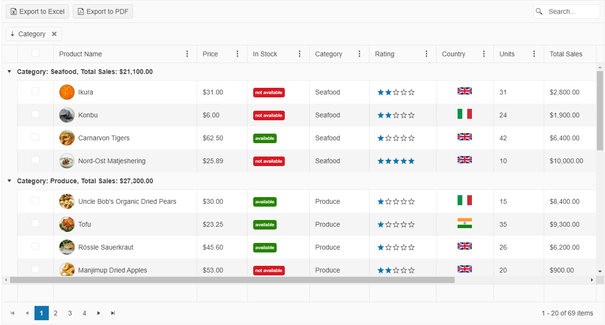

# {{ site.product }} Grid Overview

The Grid is a powerful control for displaying data in a tabular format.

It provides options for executing data operations, such as paging, sorting, filtering, grouping, and editing, which determine the way the data is presented and manipulated. The Grid supports data binding to local and remote sets of data by using the Kendo UI for jQuery DataSource component.

## Functionality and Features

|Feature|Definition
|:---   |:---
|[Data binding]() | By default, the Grid automatically binds to data through the DataSource component. However, you can disable this behavior and bind the control to [local arrays of data]() and to [remote data]() of your choice. 
|[Editing]() | The Grid supports various types of editing scenarios such as [creating and saving batch updates](), [editing data inline on row click](), or [in a popup](), and also enables you to [implement custom column editors and specify your own validation rules]().   
|[Filtering]() | You can control the filtering functionality of the Grid and implement header row, checkbox, and custom menu filtering.
|[Grouping]() | The Grid enables you to group its data by using row templates and while paging is enabled. Additionally, you can [load groups on demand and page through the groups at the same time]() and [display aggregated number results]().
|[Paging]() | You can paginate your Grid data as required and optimize the performance of the control by applying the paging operations on the server.
|[Sorting]() | The Grid allows you to cover a set of sorting approaches by providing the single-, multi-, and mixed-sort modes. 
|Export options | The Grid enables you to export it to [Excel]() and [PDF]() documents, and also delivers options to [print only its contents]() and ignore the rest of the page.
|[Column enhancements]() | The Grid provides various options to control its column behavior by delivering features such as [locked]() and [sticky columns](), [built-in column operations](), [multi-column headers]() as well as supporting [column resizing]() and [column reordering]() actions.  
|[State persistence]() | You persist the state of the Grid if saving custom user settings and restoring them afterwards is required.
|[Hierarchy]() | The Grid also enables you to visualize the relations between parent and child records and display the table data in a hierarchical fashion.
|Templates | You can use the available Grid options for implementing [row](), [column](), ad [group templates]().
|[Scroll modes]() | The scrolling feature of the Grid includes the [endless scroll mode]() and [virtual scrolling optimization](). 
|[Selection]() | The Grid is highly flexible on selection as it provides a number of selection modes such as the checkbox-column, single-row, multi-row, single-cell, and multi-cell selection mechanisms. 
|Rendering and styling | You can take full advantage of the appearance control options the Grid provides, which include [adaptive rendering](), [initializing the Grid in hidden containers](), [styling its rows](), and [setting its height]() and [width]().
|[Globalization]() | The Grid supports globalization to ensure that it can fit well in any application, no matter what [languages and locales]() need to be supported. Additionally, the Grid supports [rendering in a right-to-left (RTL) direction]().
|[Accessibility]() | The Grid is accessible for screen readers, supports WAI-ARIA attributes, and delivers [keyboard shortcuts for faster navigation]().

## Next Steps 

* [Getting Started with the Kendo UI Grid for jQuery]()
* [Basic Usage of the Grid (Demo)](https://demos.telerik.com/kendo-ui/grid/index)
* [JavaScript API Reference of the Grid](/api/javascript/ui/grid)

## See Also

* [Initializing the Grid from an HTML Table (Guide)]()
* [Initializing the Grid from an HTML Table (Demo)](https://demos.telerik.com/kendo-ui/grid/from-table)
* [Demo Page for the jQuery Data Grid](https://demos.telerik.com/kendo-ui/grid/index)
* [JavaScript API Reference of the Grid](/api/javascript/ui/grid)
* [Knowledge Base Section](/knowledge-base)
