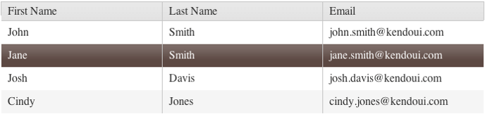

# Selection

By default, selection in the Grid is disabled.

For a runnable example, refer to the [demo on selection in the Grid](https://demos.telerik.com/kendo-ui/grid/selection).

> To boost the performance of the Grid when it is rendering a huge number of items and selection is enabled, use paging and a reasonable page size.

## Getting Started

To enable the selection functionality of the Grid, set the [`selectable`](/api/javascript/ui/grid/configuration/selectable) option to `true`. As a result, the default single-row selection functionality will be applied.

        $("#grid").kendoGrid({
            selectable: true,
            // Other configuration.
         });

**Figure 1: A Grid with enabled row selection**

## Select Modes

The Grid supports the following select modes:
* [Checkbox-column selection](#checkbox-column-selection)
* [Single-row selection](#single-row-selection)
* [Multi-row selection](#multi-row-selection)
* [Single-cell selection](#single-cell-selection)
* [Multi-cell selection](#multi-cell-selection)

> * The Grid does not support the simultaneous usage of the built-in checkbox-column selection and the selection which is enabled through the [`selectable`](/api/javascript/ui/grid/configuration/selectable) option.
> * To persists the selection of rows in a Grid which is re-bound, that is, when paging, filtering, sorting, editing, or virtual scrolling occur, enable the [`persistSelection`](/api/javascript/ui/grid/configuration/persistselection) property. To persist the row selection and avoid the usage of the `persistSelection` property, refer to the knowledge base article on [persisting row selection during data operations]().

### Checkbox-Column Selection

As of the R2 2017 SP1 release, the Grid provides an option for setting multiple selection through rendering a checkbox column. To enable the checkbox column selection, configure the [`columns.selectable`](/api/javascript/ui/grid/configuration/columns.selectable) property. Enabling the `selectable` property for a column will also render a checkbox in the header and will allow the selection and deselection of all rows on the current page.

    $("#grid").kendoGrid({
      columns: [
        { selectable: true },
        { field: "name" }
      ],
      dataSource: [ { name: "Jane Doe" }, { name: "John Doe" } ]
    });

### Single-Row Selection

The single-row selection is enabled through the default configuration of the `selectable` option to `row`. `selectable: "row"` functions in the same way as the `selectable: true` one.

    $("#grid").kendoGrid({
        selectable: "row",
        // Other configuration.
    });

### Multi-Row Selection

To enable the selection of multiple Grid rows, set `selectable` to `multiple row`. When the multiple row selection is enabled, the user can select multiple rows by dragging them.

    $("#grid").kendoGrid({
      selectable: "multiple row",
      // Other configuration.
      });

### Single-Cell Selection

To enable the selection of individual Grid cells, set `selectable` to `cell`.

    $("#grid").kendoGrid({
        selectable: "cell",
        // Other configuration.
    });

### Multi-Cell Selection

To enable the selection of multiple Grid cells, set `selectable` to `multiple cell`. When the multiple cell selection is enabled, the user can select multiple cells by dragging them.

    $("#grid").kendoGrid({
        selectable: "multiple cell",
        // Other configuration.
    });

## KB Articles on Selection

* [Selecting or Deselecting All Rows with a Select All Header Checkbox]()
* [Making the Selection with a Checkbox Column]()
* [Selecting Multiple Rows with Checkboxes]()
* [Binding the Selection to the Model Field with a Checkbox Column]()
* [Find Out More in the Knowledge Base](/knowledge-base)

## See Also

* [JavaScript API Reference of the Grid](/api/javascript/ui/grid)
* [Knowledge Base Section](/knowledge-base)
