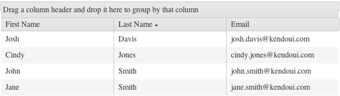

# Sorting

By default, sorting in the Grid is disabled.

For a runnable example, refer to the [demo on sorting in the Grid](https://demos.telerik.com/kendo-ui/grid/sorting).

## Getting Started

To enable the sorting functionality of the Grid, set the `sortable` option to `true`. As a result, the default single-column sorting functionality will be applied.  

To enhance the performance of the Grid, apply the sorting operations on the server by setting the `serverSorting` option of the data source to `true`. When server-sorting is enabled, you will receive the default `orderBy` parameter which contains the field name of the column by which the sorting of the dataset will be applied.

**Figure 1: A Grid with its sorting functionality enabled**

## Sort Modes

The Grid supports the following sort modes:
* [Single-column sort mode](#single-column-sorting)
* [Multi-column sort mode](#multi-column-sorting)

### Single-Column Sorting

By default, the Grid applies single-column sorting when `sortable` is set to `true`. You can also configure the single-column sort mode by setting the `mode` option of `editable` to `single`.

###### Example

    $("#grid").kendoGrid({
         sortable: true
         // Other configuration.
    });

### Multi-Column Sorting

To enable multi-column sorting, set the `mode` option of `editable` to `multiple`.

###### Example

    $("#grid").kendoGrid({
        sortable: {
            mode: "multiple"
        },
        // Other configuration.
    });

## See Also

* [Sorting by the Grid (Demo)](https://demos.telerik.com/kendo-ui/grid/sorting)
* [JavaScript API Reference of the Grid](/api/javascript/ui/grid)
* [Knowledge Base Section](/knowledge-base)
