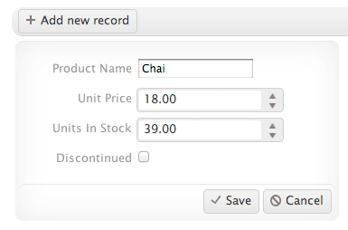

# Walkthrough

The purpose of the ListView is to display a custom layout of data-bound items through templates.

The ListView is ideally suited for scenarios where you wish to display a list of items in a consistent manner. You can see commonplace examples of its use in the design structures of the Internet, search engine results, tweets from Twitter, Facebook updates, inbox items in Gmail, card lists in Trello, and so on.

## Basic Usage

The ListView enables you to control the display of data. It does not provide a default rendering of data-bound items. Instead, it relies on templates to define the way a list of items is displayed, including alternating items and items being edited.

### Target Elements

To demonstrate how the ListView works, define a target HTML element such as a `<list>` or a `<div>`.

    <div id="listView"></div>

    <script type="text/x-kendo-tmpl" id="template">
        <div class="product">
            
            <h3>#:ProductName#</h3>
            <p>#:kendo.toString(UnitPrice, "c")#</p>
        </div>
    </script>

> **Important**
>
>  The ListView item template needs to have only one root element. In the previous example, this is the `div.product` element.

### Templates

To initialize the ListView, refer the template. It displays the result set by the service.

    var dataSource = new kendo.data.DataSource({
        transport: {
            read: {
                url: "https://demos.telerik.com/kendo-ui/service/Products",
                dataType: "jsonp"
            }
        }
    });

    $("#listView").kendoListView({
        dataSource: dataSource,
        template: kendo.template($("#template").html())
    });

The following demo shows the case displayed in the previous example.

```dojo
<div id="listView" style="max-height:400px;overflow:auto;"></div>

<script type="text/x-kendo-tmpl" id="template">
    <div class="product">
        
        <h3>#:ProductName#</h3>
        <p>#:kendo.toString(UnitPrice, "c")#</p>
    </div>
</script>

<script>

var dataSource = new kendo.data.DataSource({
    transport: {
        read: {
            url: "https://demos.telerik.com/kendo-ui/service/Products",
            dataType: "jsonp"
        }
    }
});

$("#listView").kendoListView({
    dataSource: dataSource,
    pageable: true,
    template: kendo.template($("#template").html())
});

</script>
```

### Paging

When the number of items that are bound to a ListView is larger than expected, a `pager` will control the items that are displayed. To use a Pager:

1. Create a target element for its rendering. It is typically placed near the ListView.

        <div id="listView"></div>
        <div class="k-page-wrap">
            <div id="pager"></div>
        </div>

        <script type="text/x-kendo-tmpl" id="template">
            <div class="product">
                
                <h3>#:ProductName#</h3>
                <p>#:kendo.toString(UnitPrice, "c")#</p>
            </div>
        </script>

1. Update the ListView configuration through its `pageable` property to state that the widget supports paging and to initialize the `pager`.

        var dataSource = new kendo.data.DataSource({
            transport: {
                read: {
                    url: "https://demos.telerik.com/kendo-ui/service/Products",
                    dataType: "jsonp"
                }
            },
            pageSize: 4
        });

        $("pager").kendoPager({
            dataSource: dataSource
        });

        $("#listView").kendoListView({
            dataSource: dataSource,
            pageable: true,
            template: kendo.template($("#template").html())
        });

The following demo represents the same example with a `pager` applied to the ListView.

```dojo
<div id="listView" style="max-height:400px;overflow:auto;"></div>
<div id="pager"></div>


<script type="text/x-kendo-tmpl" id="template">
    <div class="product">
        
        <h3>#:ProductName#</h3>
        <p>#:kendo.toString(UnitPrice, "c")#</p>
    </div>
</script>

<script>
var dataSource = new kendo.data.DataSource({
    transport: {
        read: {
            url: "https://demos.telerik.com/kendo-ui/service/Products",
            dataType: "jsonp"
        }
    }
});

$("pager").kendoPager({
    dataSource: dataSource
});

$("#listView").kendoListView({
    dataSource: dataSource,
    pageable: true,
    template: kendo.template($("#template").html())
});
</script>

```

### Alternate Items

Your project might require you to visually differentiate each alternating item in a ListView. For example, you might need to render each second item from the previous example in a slightly darker background, that is, banded rows. To achieve this behavior through the use of a template that you set, define the `altTemplate` property.

The following example demonstrates how you can update your working project to include a template for alternating items.

    <div id="listView"></div>
    <div class="k-page-wrap">
        <div id="pager"></div>
    </div>

    <script type="text/x-kendo-tmpl" id="template">
        <div class="product">
            
            <h3>#:ProductName#</h3>
            <p>#:kendo.toString(UnitPrice, "c")#</p>
        </div>
    </script>

    <script type="text/x-kendo-tmpl" id="altTemplate">
        <div class="product alt">
            
            <h3>#:ProductName#</h3>
            <p>#:kendo.toString(UnitPrice, "c")#</p>
        </div>
    </script>

The following demo represents the live example by using a template for alternating items.

```dojo

<div id="listView" style="max-height:400px;overflow:auto;"></div>
<div class="k-pager-wrap">
    <div id="pager"></div>
</div>

<script type="text/x-kendo-tmpl" id="template">
    <div class="product">
        
        <h3>#:ProductName#</h3>
        <p>#:kendo.toString(UnitPrice, "c")#</p>
    </div>
</script>

    <script type="text/x-kendo-tmpl" id="altTemplate">
        <div class="product alt">
            
            <h3>#:ProductName#</h3>
            <p>#:kendo.toString(UnitPrice, "c")#</p>
        </div>
    </script>

<script>
var dataSource = new kendo.data.DataSource({
    transport: {
        read: {
            url: "https://demos.telerik.com/kendo-ui/service/Products",
            dataType: "jsonp"
        }
    },
    pageSize: 3
});

$("#pager").kendoPager({
    dataSource: dataSource
});

$("#listView").kendoListView({
    dataSource: dataSource,
    template: kendo.template($("#template").html()),
    altTemplate: kendo.template($("#altTemplate").html()),
});
</script>

<style>
    .alt { background-color: #EEE; }
</style>

```

### Selection, Navigation, and Editing

In addition to paging, the ListView provides item selection, navigation, and inline editing functionalities. The support of these operations is achieved through the initialization of its Boolean configuration options. In the case of inline editing, the ListView provides the `editTemplate` property, which defines a template for this mode. Once defined, the ListView can render out this editing template through the edit method. When invoked, the `editTemplate` for the ListView is applied against the target item. In most scenarios, you have to implement this through an event model that is triggered when the user selects an item to modify.

The ListView encapsulates operations for adding, removing, selecting, and editing items. These methods enable you to modify the underpinning list of items through a series of user-initiated actions or events. Regarding inline editing, you need to first define a template that will be used when you edit the items.

    <script type="text/x-kendo-tmpl" id="editTemplate">
        <div class="product-view k-widget">
            <div class="edit-buttons">
                <a class="k-button k-button-icontext k-update-button" href="\\#"><span class="k-icon k-update"></span></a>
                <a class="k-button k-button-icontext k-cancel-button" href="\\#"><span class="k-icon k-cancel"></span></a>
            </div>
            <dl>
                <dt>Product Name</dt>
                <dd>
                    <input type="text" class="k-textbox" data-bind="value:ProductName" name="ProductName" required="required" validationMessage="required" />
                    <span data-for="ProductName" class="k-invalid-msg"></span>
                </dd>
                <dt>Unit Price</dt>
                <dd>
                    <input type="text" data-bind="value:UnitPrice" data-role="numerictextbox" data-type="number" name="UnitPrice" required="required" min="1" validationMessage="required" />
                    <span data-for="UnitPrice" class="k-invalid-msg"></span>
                </dd>
                <dt>Units In Stock</dt>
                <dd>
                    <input type="text" data-bind="value:UnitsInStock" data-role="numerictextbox" name="UnitsInStock" required="required" data-type="number" min="0" validationMessage="required" />
                    <span data-for="UnitsInStock" class="k-invalid-msg"></span>
                </dd>
                <dt>Discontinued</dt>
                <dd><input type="checkbox" name="Discontinued" data-bind="checked:Discontinued"></dd>
            </dl>
        </div>
    </script>

    $(document).ready(function(){
        $("#listView").kendoListView({
            selectable: true,
            navigatable: true,
            template: kendo.template($("#template").html()),
            editTemplate: kendo.template($("#editTemplate").html())
        });
    });

The template you define for the inline editing of items may include other Kendo UI widgets. For more information on how to define a series of widgets for editing an item, refer to [the example on KendoUI.com](http://demos.telerik.com/kendo-ui/web/listview/editing.html).

**Figure 1: ListView item editing**



The new `add` record functionality of ListView items is triggered by a `click` event that is initiated by a user and is wired up through `.click()` in jQuery.

    $(".k-add-button").click(function(e) {
        listView.add();
        e.preventDefault();
    });

Item selection is another scenario supported by the ListView widget. By setting the selectable property to either `"single"` or `"multiple"`, you can allow users to select items.

    $("#listView").kendoListView({
        dataSource: dataSource,
        selectable: "multiple",
        template: kendo.template($("#template").html())
    });

You can also detect when users pick up items through the `change` event, which is triggered upon their selecting one or more items via shift-select.

    $("#listView").kendoListView({
        change: function(e) {
            var data = dataSource.view();
            var selected = $.map(this.select(), function(item) {
                return data[$(item).index()].ProductName;
            });

            // index selected or read item information through data
        }
    });

The following demo shows how to enable the item selection functionality.

```dojo
<div id="listView" style="max-height:400px;overflow:auto;"></div>
<div class="k-pager-wrap">
    <div id="pager"></div>
</div>

<script type="text/x-kendo-tmpl" id="template">
    <div class="product">
        
        <h3>#:ProductName#</h3>
        <p>#:kendo.toString(UnitPrice, "c")#</p>
    </div>
</script>


<script>
var dataSource = new kendo.data.DataSource({
    transport: {
        read: {
            url: "https://demos.telerik.com/kendo-ui/service/Products",
            dataType: "jsonp"
        }
    },
    pageSize: 3
});

$("#pager").kendoPager({
    dataSource: dataSource
});

$("#listView").kendoListView({
    selectable: true,
    dataSource: dataSource,
    template: kendo.template($("#template").html())
});
</script>


<style>
    .alt { background-color: #EEE; }
</style>

```

## See Also

* [JavaScript API Reference](/api/javascript/ui/listview)
* [Overview]()
* [How to Reorder Using Drag-and-Drop and Kendo UI Touch]()
* [How to Filter Using Slider Selection]()
* [How to Persist Row Selection during Data Operations]()
