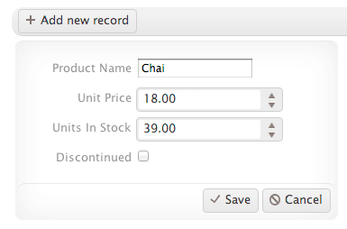

# Editing

By default, the editing feature of the ListView is disabled.

## Getting Started

To enable editing, use the Boolean options. For more information, refer to the article on [editing widgets]().

      $(document).ready(function() {
          $("#listView").kendoListView({
             selectable: true,
             navigatable: true,
             editable: true,
             template: "<li>${FirstName}</li>",
             editTemplate: '<li><input type="text" data-bind="value:FirstName" name="FirstName" required="required"/></li>'
          });
      });

## Advanced Configuration

The ListView provides the `editTemplate` property, which defines a template for this mode. Once defined, the ListView can render out this editing template through the edit method. When invoked, the `editTemplate` for the ListView is applied against the target item. In most scenarios, you have to implement this through an event model that is triggered when the user selects an item to modify.

The ListView encapsulates operations for adding, removing, selecting, and editing items. These methods enable you to modify the underpinning list of items through a series of user-initiated actions or events. Regarding inline editing, you need to define a template that will be used when you edit the items.

    

    $(document).ready(function(){
        $("#listView").kendoListView({
            selectable: true,
            navigatable: true,
            template: kendo.template($("#template").html()),
            editTemplate: kendo.template($("#editTemplate").html())
        });
    });

The template you define for the inline editing of items may include other Kendo UI widgets. For more information, refer to [demo on defining a series of widgets for editing an item](https://demos.telerik.com/kendo-ui/web/listview/editing.html).

The new `add` record functionality of ListView items is triggered by a `click` event that is initiated by a user and is wired up through `.click()` in jQuery.

    $(".k-add-button").click(function(e) {
        listView.add();
        e.preventDefault();
    });

## See Also

* [Basic Usage of the ListView (Demo)](https://demos.telerik.com/kendo-ui/listview/index)
* [JavaScript API Reference of the ListView](/api/javascript/ui/listview)
