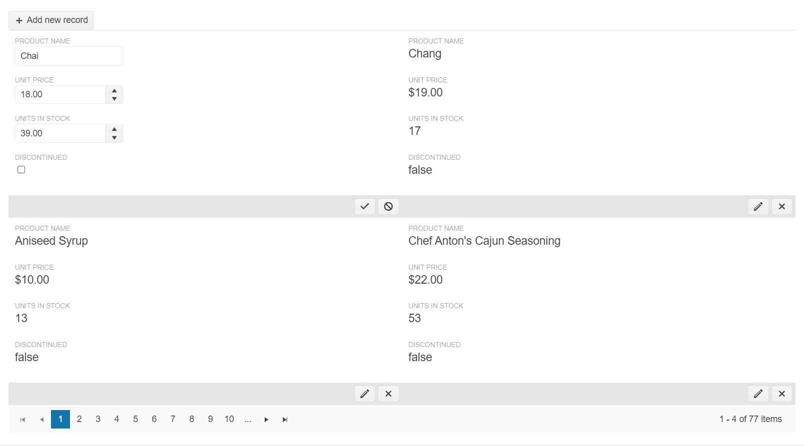

# {{ site.product }} ListView Overview

The Kendo UI ListView enables you to display a custom layout of data-bound items.

The ListView is ideally suited for displaying a list of items in a consistent manner. You can see commonplace examples of its use in the design structures of the Internet, search engine results, tweets from Twitter, Facebook updates, inbox items in Gmail, card lists in Trello, and so on.

The ListView can be bound to local JSON data or to remote data by using the Kendo UI DataSource component. It enables you to control the display of data. It does not provide a default rendering of data-bound items. Instead, it relies on templates to define the way a list of items is displayed, including alternating items and items that are in the process of editing.

## Functionality and Features

* [Items]()&mdash;The ListView allows you to visually differentiate each alternating item in a ListView.
* [Editing]()&mdash;The ListView allows you to edit its dataitems.
* [Selection]()&mdash;The ListView supports the item selection functionality.
* [Paging]()&mdash;You can paginate your ListView data to optimize the performance of the widget.
* [Scrolling]()&mdash;You can add scrolling functionality to the ListView.
* [Templates]()&mdash;The ListView allows you to use templates to format the appearance of the items.

## Next Steps 

* [Getting Started with the Kendo UI ListView for jQuery]()
* [Basic Usage of the ListView (Demo)](https://demos.telerik.com/kendo-ui/listview/index)
* [JavaScript API Reference of the ListView](/api/javascript/ui/listview)

## See Also

* [Basic Usage of the ListView (Demo)](https://demos.telerik.com/kendo-ui/listview/index)
* [JavaScript API Reference of the ListView](/api/javascript/ui/listview)
