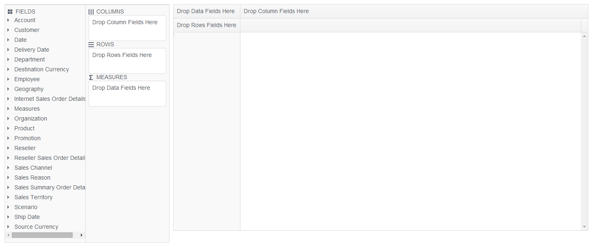

# PivotConfigurator Overview

The [Kendo UI PivotConfigurator](/api/web/pivotconfigurator) represents an OLAP cube structure.

The PivotConfigurator can be used for configuring the column and row dimensions, and the measure fields of the [PivotGrid](https://demos.telerik.com/kendo-ui/pivotgrid/index). It is a supplementary component which is strongly related to the Kendo UI `PivotDataSource` component.

## Initializing the PivotConfigurator

The following example demonstrates how to create the PivotConfigurator. To create the PivotConfigurator, define a `
` HTML element.

        <!-- Define the HTML div that will hold the PivotConfigurator -->
        

        

        <!-- Define the HTML div that will hold the PivotGrid -->
        

        

## Basic Configuration

The following example demonstrates how to configure the PivotConfigurator.

        

The following image demonstrates the output from the previous example.

## Referencing Existing Instances

To reference an existing PivotConfigurator instance, use the [`jQuery.data()`](https://api.jquery.com/jQuery.data/) method. Once a reference has been established, use the [PivotConfigurator API](/api/web/pivotconfigurator) to control its behavior.

The following example demonstrates how to access an existing PivotConfigurator instance.

    var pivotconfigurator = $("#pivotconfigurator").data("kendoPivotConfigurator");

## See Also

* [Basic Usage of the PivotGrid (Demo)](https://demos.telerik.com/kendo-ui/pivotgrid/index)
* [PivotGrid JavaScript API Reference](/api/javascript/ui/pivotgrid)
