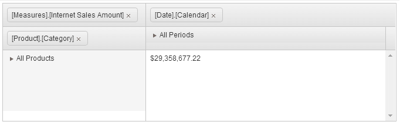

# PivotGrid Overview

The Kendo UI PivotGrid represents multidimensional data in a cross-tabular format.

* [Demo page for the PivotGrid](https://demos.telerik.com/kendo-ui/pivotgrid/index)

## Basic Configuration

To configure the PivotGrid to the **Adventure Works** cube that is hosted on https://demos.telerik.com, create the widget by defining an HTML `
` element.

		<!-- Define	 the HTML div that will hold the PivotGrid -->
		

		

The following example demonstrates how to further configure the PivotGrid widget.

        

The previous example outputs the following result.

## Functionality and Features

* [Data binding]()
* [Filtering]()
* [Sorting]()
* [Excel export]()
* [PDF export]()

## Referencing Existing Instances

To reference an existing PivotGrid instance, use the [`jQuery.data()`](https://api.jquery.com/jQuery.data/) method. Once a reference has been established, use the [PivotGrid API](/api/web/pivotgrid) to control its behavior.

The following example demonstrates how to access an existing PivotGrid instance.

    var pivotgrid = $("#pivotgrid").data("kendoPivotGrid");

## See Also

* [Basic Usage of the PivotGrid (Demo)](https://demos.telerik.com/kendo-ui/pivotgrid/index)
* [PivotGrid JavaScript API Reference](/api/javascript/ui/pivotgrid)
