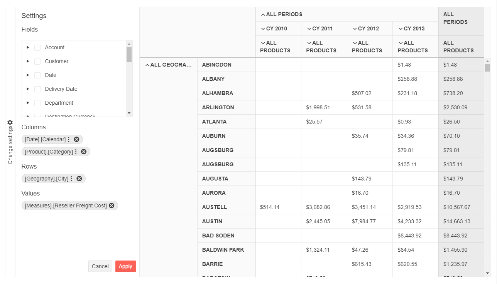

# PivotConfiguratorV2 Overview

The [Kendo UI PivotConfiguratorV2](/api/javascript/ui/pivotconfiguratorv2) represents an OLAP cube structure.

The PivotConfiguratorV2 can be used for configuring the column and row dimensions, and the measure fields of the [PivotGridV2](https://demos.telerik.com/kendo-ui/pivotgridv2/index). It is a supplementary component which is strongly related to the Kendo UI `PivotDataSourceV2` component.

## Initializing the PivotConfiguratorV2

There are four elements that need to be configured for the PivotConfiguratorV2 to function properly:

* PivotGridV2—The PivotGridV2 widget which will be managed by the PivotConfiguratorV2.
* PivotConfiguratorV2—The configurator widget itself.
* PivotConfiguratorButton—The button which expands/collapses the PivotConfiguratorV2.
* PivotContainer—The container which holds all of the above widgets.

The following example demonstrates the HTML structure of the elements.

    

        

        

        

    

## Basic Configuration

The following example demonstrates how to configure the widgets.

    

The following image demonstrates the output from the previous example.

## Referencing Existing Instances

To reference an existing PivotConfigurator instance, use the [`jQuery.data()`](https://api.jquery.com/jQuery.data/) method. Once a reference has been established, use the [PivotConfigurator API](/api/javascript/ui/pivotconfiguratorv2) to control its behavior.

The following example demonstrates how to access an existing PivotConfigurator instance.

    var pivotconfigurator = $("#pivotconfigurator").data("kendoPivotConfiguratorV2");

## See Also

* [Basic Usage of the PivotGridV2 (Demo)](https://demos.telerik.com/kendo-ui/pivotgridv2/index)
* [PivotGridV2 JavaScript API Reference](/api/javascript/ui/pivotgridv2)
* [PivotConfiguratorV2 JavaScript API Reference](/api/javascript/ui/pivotconfiguratorv2)
