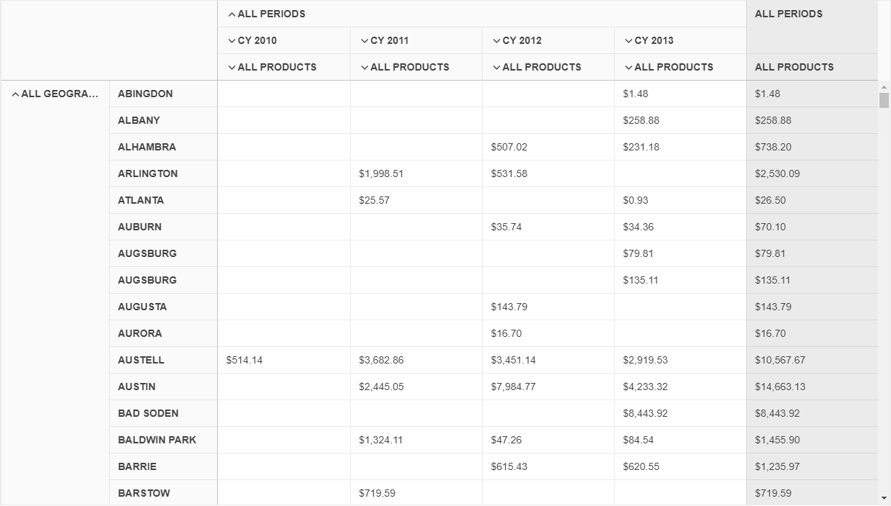

# {{ site.product }} PivotGridV2 Overview

The Kendo UI PivotGridV2 represents multidimensional data in a cross-tabular format.

* [Demo page for the PivotGridV2](https://demos.telerik.com/kendo-ui/pivotgridv2/index)

Compared to the legacy PivotGrid, the new PivotGridV2 offers a brand new design, and its future-proof architecture allows the implementation of many upcoming functionalities. As PivotGridV2 aims to replace the legacy PivotGrid, it is recommended to use the PivotGridV2 in your new projects. For information about the differences between the PivotGrid and PivotGridV2, refer to the [Comparison]() article.

## Basic Configuration

1. Start with the initialization of the PivotGridV2 widget. Create the widget by defining an HTML `
` element.

        <!-- Define	 the HTML div that will hold the PivotGridV2 -->
        

        

1. Configure PivotGridV2 to work with the **Adventure Works** cube that is hosted on https://demos.telerik.com.

        

The following image demonstrates the output from the previous example.

## Functionality and Features

* [Data binding]()
* [Comparison with the PivotGrid]()
* [Templates]()
* [PDF export]()
* [Filtering]()

## Referencing Existing Instances

To reference an existing PivotGridV2 instance, use the [`jQuery.data()`](https://api.jquery.com/jQuery.data/) method. Once a reference has been established, use the [PivotGridV2 API](/api/javascript/ui/pivotgridv2/) to control its behavior.

The following example demonstrates how to access an existing PivotGridV2 instance.

    var pivotgrid = $("#pivotgrid").data("kendoPivotGridV2");

## See Also

* [Basic Usage of the PivotGridV2 (Demo)](https://demos.telerik.com/kendo-ui/pivotgridv2/index)
* [PivotGridV2 JavaScript API Reference](/api/javascript/ui/pivotgridv2)