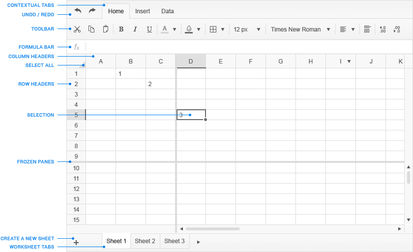

# User Guide

## Audience

This guide is intended for the end user of the Kendo UI Spreadsheet widget. It aims at providing information about the widget's functionalities for data entry/management, and support to end users while working with it.

## Table of Contents

To the left of this page is the collapsible Table of Contents. You can easily navigate through it by clicking on the title of a section you want to read.

## Organization

The instructions in this guide are organized in sections, based on the actions you might wish to execute on each spreadsheet component (sheets, rows, columns).

## Conventions

This guide uses the following conventions:

| ITEM										| CONVENTION						|
| :---										| :---								|
| Buttons, menus, tabs, dialog titles		| **boldface** font 				|
| Keyboard buttons, names of functions		| `screen` font						|
| Selection sequences of buttons or options	| **Data** > **Data Validation**	|

## Overview

Kendo UI Spreadsheet is used for implementation of related data and its visualization in a tabular format (rows and columns). This kind of data structuring provides for an easier management and analysis. The widget renders the feeling of a [Microsoft Excel table](https://support.office.com/en-ca/article/Overview-of-Excel-tables-7ab0bb7d-3a9e-4b56-a3c9-6c94334e492c) by offering many cell-formatting options, styles, and themes, while utilizing simpler and easy-to-master user interface.

##### Main Elements of the Kendo UI Spreadsheet Widget

## Actions

### Sheets

When you open the Spreadsheet, the widget automatically generates a worksheet and applies to it a collection of default settings.

| WHAT YOU WANT			| HOW TO GET THERE	|
| :---					| :---				|
| Select 				| Click **Select All** [  ]  located to the left of column header **A** and above row header **1** on the active sheet |
| Create				| Click **+** on the Sheet Tab Bar to create a new sheet				|
| Rename 				| <ol><li> Double-click the tab of the sheet you want to rename and modify it</li> <li>Press `Enter` to exit, or click anywhere on the sheet</li></ol> |
| Reorder				| Click and hold the sheet tab, and drag it to the desired location on the Sheet Tab Bar |
| Delete				| Click **X** [  ] on the tab of the sheet you want to remove |

### Cells

| WHAT YOU WANT			| HOW TO GET THERE		|
| :---					| :---					|
| Select/activate       | Click a cell		    |
| Select a range of cells | <ol><li>Click a cell</li> <li>Extend the selection by holding down the mouse while marking the selection you want</li></ol> |
| Edit 					| Double-click a cell 	|
| Copy content			| <ol><li>Select a cell</li> <li>Click **Copy** [  ] on the **Toolbar**, or right-click the desired cell to display the context menu and choose **Copy** from it, or use the [`Ctrl` + `C`]() keyboard shortcut</li></ol>|
| Cut content			| <ol><li>Select a cell</li> <li>Click **Cut** [  ] on the **Toolbar**, or right-click the desired cell to display the context menu and choose **Cut** from it, or use the [`Ctrl` + `X`]() keyboard shortcut</li></ol> |
| Paste content			| <ol><li>Click the cell where you want to place the copied or cut content</li> <li>Click **Paste** [  ] on the **Toolbar**, or right-click the desired cell to display the context menu and choose **Paste** from it, or use the [`Ctrl` + `V`]() keyboard shortcut</li></ol> |
| Delete content		| <ol><li>Select a cell</li> <li>Press **Delete** on your keyboard to remove its content</li></ol> |
| Align content			| <ol><li>Select a cell</li> <li>Click **Alignment** [  ] on the **Toolbar**</li> <li>Choose a style form the drop-down list</li></ol> |
| Wrap content				| <ol><li>Select a cell that contains the content you want to wrap</li> <li>Click **Wrap Text** [  ] on the **Toolbar**</li></ol> |
| Merge cells			| <ol><li>Select the cells you want to merge</li> <li>Right-click the selection > **Merge**</li> <li>Select the option from the **Merge Cells** pop-up window</li></ol> |
| Merge cells (via **Toolbar**)	|<ol><li>Select the cells you want to merge</li> <li>Click **Merge Cells** [  ] on the **Toolbar**</li> <li>Choose an option from the drop-down list</li></ol> |
| Add a background color| <ol><li>Select a cell</li> <li>Click **Background** [  ] on the **Toolbar**</li> <li>Choose a color from the drop-down list to apply to the cell background</li></ol> |
| Choose border styles and colors | <ol><li>Select a cell</li> <li>Click **Borders** [  ] on the **Toolbar**</li> <li>Select the border style and/or the color from the drop-down list</li> <li>Click anywhere on the sheet to exit</li></ol> |

### Rows

| WHAT YOU WANT			| HOW TO GET THERE		|
| :---					| :---					|
| Select/activate		| Click the row header against of the row you want to select |
| Insert				| <ol><li>Select a row by clicking on the respective row header</li> <li>Click the **Insert** tab from the **Menu**</li> <li>Click **Add Row Below** [  ] or **Add Row Above** [  ] on the **Toolbar**</li></ol> |
| Delete				| <ol><li>Right-click the row header</li> <li>Choose **Delete**</li></ol> |
| Delete (via **Toolbar**) | <ol><li>Select a row by clicking on its row header</li> <li>In the **Menu** click **Insert**</li> <li>On the **Toolbar** click **Delete Row** [  ]</li></ol> |
| Hide					| <ol><li>Select the rows by clicking on the respective row header</li> <li>Right-click the row header</li> <li>Choose **Hide**</li></ol> |
| Wrap content				| <ol><li>Select a row</li> <li>Click **Wrap Text** [  ] on the **Toolbar**</li></ol> |
| Resize the height of a row | <ol><li>Select a row or a cell from a row</li> <li>Hover the pointer over the row header field until either the upper or bottom field border is highlighted</li> <li>Click the highlighted area and hold while dragging it to the desired height. Release the hold.</li></ol> |
| Add a background color | <ol><li>Select a row</li> <li>On the **Toolbar** click **Background** [  ]</li> <li>Select the color from the drop-down list</li></ol> |
| Choose border styles and colors | <ol><li>Select a row</li> <li>Click **Borders** [  ] on the **Toolbar**</li> <li>Select the border style and/or the color from the drop-down list</li> <li>Click anywhere on the worksheet to exit</li></ol> |

### Columns

| WHAT YOU WANT			| HOW TO GET THERE		|
| :---					| :---					|
| Select/activate 		| Click the column header against the column you want to select |
| Insert				| <ol><li>Select a column by clicking on the respective column header</li> <li>Click the **Insert** tab from the **Menu**</li> <li>On the **Toolbar** click **Add Column Left** [  ] or **Add Column Right** [  ]</li></ol> |
| Delete				| <ol><li>Select the columns by clicking on the respective column header</li> <li>In the **Menu** click **Insert**</li> <li>On the **Toolbar** click **Delete Column** [  ]</li></ol> |
| Hide					| <ol><li>Select a column by clicking on the respective column header</li> <li>Right-click the column header</li> <li>Choose **Hide**</li></ol> |
| Wrap content			| <ol><li>Select the column whose content you want to wrap</li> <li>Click **Wrap Text** [  ] on the **Toolbar**</li></ol> |
| Resize the width of a column | <ol><li>Select a column or a cell within a column</li> <li>Hover the pointer over the column header field until either the left or right border is highlighted</li> <li>Click the highlighted area and hold while dragging it to the desired width. Release the hold.</li></ol> |
| Add a background color | <ol><li>Select a  column</li> <li>On the **Toolbar** click **Background** [  ]</li> <li>Select the color from the drop-down list</li></ol> |
| Choose border styles and colors | <ol><li>Select a column</li> <li>Click **Borders** [  ] on the **Toolbar**</li> <li>Select the border style and/or the color from the drop-down list</li> <li>Click anywhere on the sheet to exit</li></ol> |

### Fonts

| WHAT YOU WANT			| HOW TO GET THERE		|
| :---					| :---					|
| Choose fonts			| <ol><li>Select the cells to which you want to apply the font</li> <li>On the **Toolbar** click **Font** [  ]</li> <li>Choose a font type from the drop-down list</li></ol> |
| Edit font sizes 	| <ol><li>Select the cells to which you want to apply the font size</li> <li>On the **Toolbar** click **Font Size** [  ]</li> <li>Choose the font size from the predetermined values in drop-down list</li></ol> |
| Format fonts			| <ol><li>Select the cells where you want to format the font</li> <li>Use any of the following commands:</li></ol> <ul><ul><li>To make make the font **bold**, click **Bold** [  ] on the **Toolbar**</li> <li>To make make the font <i>italic</i>, click **Italic** [  ] on the **Toolbar**</li> <li>To make make the font <u>underlined</u>, click **Underline** [  ] on the **Toolbar**</li></ul></ul> |

### Filters

| WHAT YOU WANT				| HOW TO GET THERE		|
| :---						| :---					|
| Sort fields   		    | <ol><li>Click **Data** on the **Tab Bar**</li> <li>Select a column</li> <li>Click **Sort** [  ] on the **Toolbar** and choose any of the two options from the drop-down list:</li> <ul><ul><li>**Sort range A to Z** sorts the content within the selected columns in ascending order</li> <li>**Sort range Z to A** sorts the content within the selected columns in descending alphabetical order</li></ul></ul></ol> |
| Unsort fields             | <ul><li>Click **Undo** [  ] on the **Menu** to reverse the sorting you made.</li></ul> <ul>Оr</ul> <ul><li>Add a new column. Check which is the last active field of the columns whose data you want to sort. Then add a subsequent number (1, 2, 3, etc.) to each field of the recently added column ending with the field in the same row as the last field of the columns whose content you want to sort. In this way you can revert the sorting of the target columns by applying the sorting option in ascending order to the recently added helper column.</li></ul> |
| Filter information        | <ol><li>Click **Data** on the **Tab Bar**</li> <li>Select the columns to which you want to apply the filtering criteria</li> <li>Click **Filter** [  ] on the **Toolbar**</li> <li>Choose from the drop-down list of options:</li> <ul><ul><li>**Sort range A to Z** sorts the data within the columns in ascending alphabetical order</li> <li>**Sort range Z to A** sorts the data within the columns in descending alphabetical order</li> <li>**Filter by condition** filters the data within the column by applying any of the conditions from the drop-down list of options. Each of them can be applied to text fields, dates, or numbers:</li> <ul><ul><li><u>Text fields:</u> Choose any of the options referring to texts from the **Filter by condition** drop-down list. Fill in the field below to set the filter condition. Click **Apply**. For example, choose **Text starts with**, set the condition to **E**, and click **Apply**. The result shows all rows containing text fields that start with an **E**. You can alphabetically sort the filtered infromation by clicking **Sort range A to Z** or **Sort range Z to A**.</li> <li><u>Dates:</u> Choose any of the options referring to dates from the **Filter by condition** drop-down list. Fill in the field below to set the filter condition. Click **Apply**. For example, choose **Date is**, set the condition to **6/30/2014**, and click **Apply**. The result is a list of only rows containing fields that display the date 6/30/2014. Note that the date format may differ depending on the order of date components. Make sure you check the current format before applying this filter.</li> <li><u>Numbers:</u> Choose any of the options referring to numbers from the **Filter by condition** drop-down list. Fill in the field below to set the filter condition. Click **Apply**. For example, choose **Is equal to**, set the condition to **10230**, and click **Apply**. The result is a list of only rows containing fields that display the number 10230.</li></ul></ul></ul></ul> <ul><ul>To retrieve all applied filters and sorting conditions, from **Filter by condition** choose **None** > **Apply**.</ul></ul> <ul><ul><li>**Filter by value** provides more options for filtering numbers.</li> <ul><li>Select the checkbox against **All** to clear all conditions and view all rows within the active sheet</li> <li>Uncheck **All** to clear all checkboxes, and choose the values according to which you want to filter the data in the selected columns.</li></ul></ul></ul> |

### File Import and Export

You are able to export the content of your Spreadsheet to Portable Document Format (PDF) or Excel format (.xlsx) files, as well as import Excel Workbook content to the Spreadsheet.

| WHAT YOU WANT				| HOW TO GET THERE		|
| :---						| :---					|
| Import files				| <ol><li>Click **Open** [  ] on the **Toolbar**.</li> <li>From the dialog box select the Excel Workbook you want to import by clicking on it.</li> <li>Click **Open** to load its content.</li></ol> |
| Export files 				| <ol><li> Click **Export** [  ].</li></ol>  <ul>Export to Excel <ul>2. In the **File name** field fill in a name for the file that is going to be exported. 
3. From the **Save as type** drop-down list choose **Excel Workbook (.xlsx)**.
 
4. Click **Save** to locally download the exported Excel file and follow your browser instructions to proceed further on.
</ul></ul> <ul>Export in PDF <ul>2. In the **File name** field fill in a name for the file that is going to be exported. 
3. From the drop-down list against **Save as type** choose **Portable Document Format (.pdf)**.
 
4. From the **Export** drop-down list choose which part of the content you want to export&mdash;the entire workbook, active sheet, or a partial content selection.
 
5. From the **Paper size** drop-down list pick the size in which you want the exported file to be displayed.
 
6. From the **Margins** drop-down list select what the margins of the resulting pages&mdash;normal, narrow, or wide.
 
7. Indicate whether you want to display the content of the resulting file in a horizontal or vertical orientation by clicking on the respective icon.
 
8. By checking **Guidelines** against **Print**, your exported PDF document is going to display its content in a table format with gridlines. If you want to disable the gridlines, uncheck the button. By default, **Guidelines** is checked for you to provide for the better visualization of the content.
 
9. Checking the **Fit to page** option against **Scale** is going to automatically make the content from your spreadsheets fit within the boundaries of the exported PDF document. By default, **Fit to page** is checked for you to provide for the better visualization of the content.
 
10. By checking the **Horizontally** option against **Center**, the content of the exported PDF file is going to be centered according to the horizontal margins of each exported sheet. By checking the **Vertically** option against **Center**, the content of the exported PDF file is going to be centered according to the vertical margins of each exported sheet. By default, both options are checked for you to provide for the better visualization of the content.
 
11. Click **Save** to locally download the exported PDF file and follow your browser instructions to proceed further on.
</ul></ul> |

### Other

| WHAT YOU WANT				| HOW TO GET THERE		|
| :---						| :---					|
| Auto fill                 | <ol><li>Insert textual, numeric, or textual and numeric characters of one and the same pattern in at least two subsequent column cells. For example, 1, 2.</li> <li>Select these cells.</li> <li>To copy the data series automatically, drag the fill handle across, down, or up the cells you want to fill.</li></ol> 
Note that the **Auto Fill** command does not copy the format of the cells with the initial data series and does not apply it to the target ones.
 
If you select just one cell and drag the fill handle to auto-complete adjacent cells, the command copies, but does not change in the existing pattern, the content from the initial cell to each of the target ones.

| Freeze panes				| <ol><li>Select the row or column which you want to freeze</li> <li>From the **Toolbar** click **Freeze Panes**</li> <li>Choose the option from the drop-down list</li></ol> |
| Apply the `Undo` function | Click **Undo** [  ] on the **Menu** to reverse the actions you made during your current session. The number of actions you can reverse using `Undo` is unlimited. |
| Apply the `Redo` function | Click **Redo** [  ] on the **Menu** to repeat the actions you made during your current session. The number of actions you can repeat using `Redo` is unlimited. |
| Increase decimal values	| Click **Increase Decimal** [  ] on the **Toolbar** to increase the number of digits after the decimal point |
| Decrease decimal values	| Click **Decrease Decimal** [  ] on the **Toolbar** to decrease the number of digits after the decimal point |
| Customize the format of numbers | <ol><li>Select the cells where you want to format the font</li> <li>Click **Custom Format** [  ] on the **Toolbar**</li> <li>Select an option from the drop-down list. The style of formatting is hinted to the right of each option.</li></ol> |
| Further customize the format of numbers | <ol><li>Select the cells whose content you want to format</li> <li>Click **Custom Format** [  ] > **More Formats**. Choose any of the following options:</li></ol> <ul><ul><li>**Number** customizes the format of numerical input</li> <li>**Currency** customizes the format of currency input</li> <li>**Date** customizes the format of date input</li></ul></ul> |
| Apply formulas and functions | <ol><li>Select a cell</li> <li>Go to the **Formula Bar** and type an equal sign [ `=` ]</li> <li>Type your formula/function and press `Enter` once done to see the outcome of your input in the cell. Note that when you start writing a function, the `AutoComplete` prompts you with the syntax.</li></ol> |
| Edit formulas and functions 	| <ol><li>Double-click a cell to display the formula/function in the **Formula Bar**</li> <li>Change the formula/function and press `Enter`</li></ol> |
| Validate data				| Data validation allows you to predetermine the format and constrain the value of the content of a single cell or cells within a range, column, or row: <ol><li>Select a cell or a range of cells</li> <li>In the **Menu** click **Data** > **Data Validation** to open the **Data Validation** window</li> <li>Choose the criterion from the drop-down list of options.</li> <li>A new window with criteria-specific options appears. Use the prompts and drop-down options to set the rules for modifying the content.</li></ol> |
| Choose data from predefined values | 
The Spreadsheet supports the implementation of custom editors. They facilitate your input of data in a cell by providing you with predefined date and list values that are already placed in the necessary format.
 
For example, if you are asked to fill in a date in a cell, clicking the icon of the custom editor of that cell provides you with a calendar. Choose the desired date without bothering about the syntax you are supposed to use to fill it in.
 <ol><li>Select a cell.</li> <li>An icon appears right next to it. Click on it to see the options that are predefined for you to choose from. |

 

> **Important**
> * Whenever **Cancel** is displayed as a command, click it if you want to close an active drop-down list or menu, or exit an open window, and return to the worksheet.
> * Whenever **Apply** is displayed as a command, click it if you want an option you selected to be applied.

## Formulas and Functions

The Spreadsheet widget supports many of the Excel formulas and functions as seen in the [List of Formulas and Functions](/web/spreadsheet/end-user/list-of-formulas).

## Keyboard Navigation

The Spreadsheet widget supports many of the Excel keyboard shortcuts as shown in the [List of Keyboard Shortcuts](/web/spreadsheet/end-user/list-of-shortcuts).

## Known Limitations

- Because of specific requirements, browsers may not support the **Paste** command when initiated from the context menu or the **Toolbar**. If you try to apply the command in either of these ways, a popup message is displayed informing you about the limitation. Use the keyboard navigation to achieve the result.
- Formulas which are very deeply nested might produce a stack overflow error. For example, `=sin(cos(sin(cos(...))))` or `=A1+A2+A3+...+A200`&mdash;even though the latter does not seem nested&mdash;is internally treated like `=((((...(A1+A2)+A3)+A4)+...+)+A200)`).

**Solution**

Use `SUM` for cases like the second formula demonstrated above. When not possible, avoid nesting more than 100 levels deep. Note that the maximum depth depends on the browser, but 100 is considered to be a safe limit.

## See Also

Other articles on Kendo UI Spreadsheet:

* [List of Keyboard Shortcuts]()
* [List of Formulas and Functions]()
