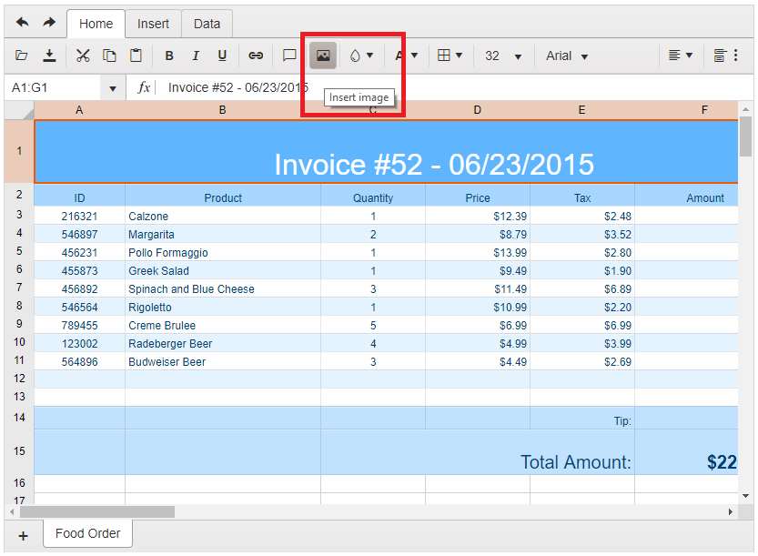
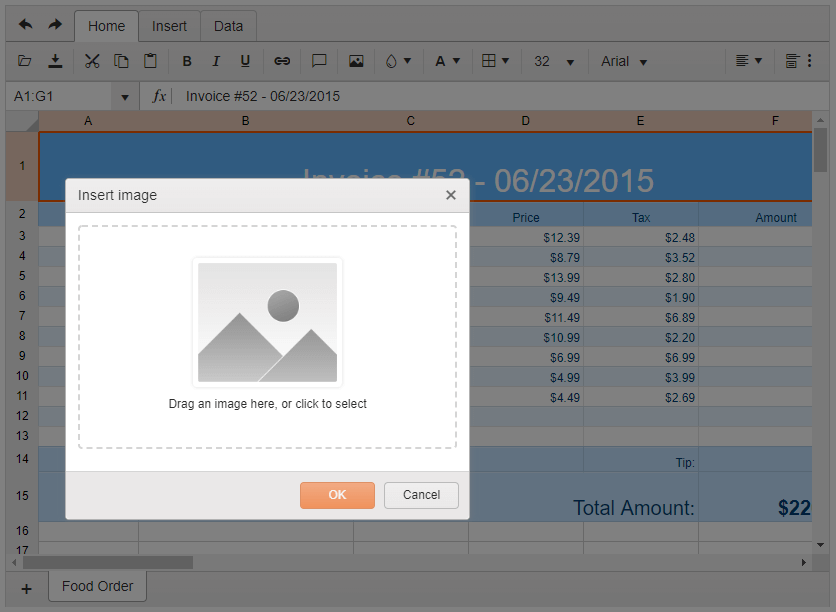

# Images

The Spreadsheet offers support for images to be placed on its sheets.

There are three options that would allow you to load an image on a sheet:

* Use the Insert Image tool available on the Spreadsheet toolbar.

* Use the initial configuration of the Spreadsheet to load and point to the widget.

* Use the `sheet.addImage()` API method.

## Use the Insert Image Tool

The user can upload and insert in the Spreadsheet a custom image using the `Insert Image` tool:

**Figure 1: The Insert Image Tool**



Then, in the pop-up window, she can select or drag-in a file from the file system:

**Figure 2: The Insert Image Tool**



## Configure Spreadsheet to Display Initially an Image

To properly configure the Spreadsheet to display an image on one its sheets, you should first add a definition for the image to the Spreadsheet [`images`](/api/javascript/ui/spreadsheet/configuration/images) field. In the `images` object each image should be specified with unique key (property name) holding as value the image URL. The image URLs can be either [data URLs](https://developer.mozilla.org/en-US/docs/Web/HTTP/Basics_of_HTTP/Data_URIs), in which case the images are fully contained in the definition, or can be external URLs:

```
    images: {
        testImage: "../images/1.jpg"
    }
```

Then you should reference that image and place it accordingly using the [`drawings`](/api/javascript/ui/spreadsheet/configuration/sheets.drawings) array of the respective sheet. The drawing definition should contain:

* A pointer to the cell that will hold the top-left corner of the image: `topLeftCell: "J6"`.

* X and Y offset of the top-left corner: `offsetX: 30, offsetY: 10`.

* Dimensions of the rendered image: `width: 320, height: 220`.

* A pointer to the image key that is used in the `images` field of the Spreadsheet: `image: "testImage"`.

The below example demonstrates how to inside an image in a Spreadsheet and display it with top-left corner placed in the `J6` cell:

###### Example

```dojo
    <div id="spreadsheet"></div>

    <script>
        $("#spreadsheet").kendoSpreadsheet({
            sheets: [{
                drawings: [{
                    topLeftCell: "J6",
                    offsetX: 30,
                    offsetY: 10,
                    width: 320,
                    height: 220,
                    image: "testImage"
                }]
            }],
            images: {
                testImage: "../images/1.jpg"
            }
        })
    </script>
```

##  Use the addImage() Method

The Spreadsheet Sheet API exposes a method that would allow you to programmatically add an image to the Spreadsheet and place in on a Sheet. To do that, a new `kendo.spreadsheet.Drawing` object should be created first. The configuration of the `Drawing` object is the same as the one described in the example from the previous section. Then, the `Drawing` should be passed to the [`sheet.addDrawing()`](/api/javascript/spreadsheet/sheet/methods/adddrawing):

```dojo
    <div id="spreadsheet"></div>

    <script>
        var spreadsheet = $("#spreadsheet").kendoSpreadsheet({
            sheets: [{
                drawings: [{
                    topLeftCell: "J6",
                    offsetX: 30,
                    offsetY: 10,
                    width: 320,
                    height: 220,
                    image: "testImage"
                }]
            }],
            images: {
                testImage: "../images/1.jpg"
            }
        }).data("kendoSpreadsheet");

        var sheet = spreadsheet.activeSheet();

        var drawing = kendo.spreadsheet.Drawing.fromJSON({
            topLeftCell: "J6",
            offsetX: 30,
            offsetY: 10,
            width: 320,
            height: 220,
            image: spread.addImage("../images/1.jpg")
        });

        sheet.addDrawing(drawing);
    </script>
```

Note the following, while using the Spreadsheet exporting functionality in combination with images:

* Images are supported only for client-side Import/Export functionality. When engaging server Import/Export, no images will be loaded/exported.

* In order to properly export any image to PDF using the default Spreadsheet functionality, at least one cell with data should be present on the sheet containing that image.

## See Also

* [Overview]()
* [Custom Cell Editors]()
* [Comments]()
* [Custom Functions]()
* [Cell Formatting]()
* [Data Source Binding]()
* [Export to Excel]()
* [Server-Side Processing]()
* [User Guide]()
* [Spreadsheet JavaScript API Reference](/api/javascript/ui/spreadsheet)