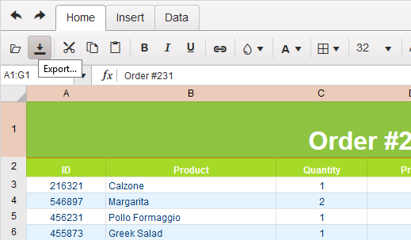

# Excel Export

The Spreadsheet utilizes the [Excel export module](/framework/excel/introduction) framework to produce Excel files directly in the browser.

The output files are in the OOXML Spreadsheet format with an `.xlsx` extension. The legacy `.xls` binary format is not supported.

## User Interface

The default toolbar configuration includes an **Export** button. Clicking it opens a dialog box for entering the file name and selecting the desired output format for the exported document.

The following image demonstrates the export of the Spreadsheet data to Excel.

## API Export Reference

The Spreadsheet client-side API includes the [`saveAsExcel`](/api/javascript/ui/spreadsheet/methods/saveasexcel) method for initiating the export via JavaScript. This method does not ask you to specify a file name. Instead, it sets the value in [`excel.fileName`](/api/javascript/ui/spreadsheet/configuration/excel.filename).

## Known Issues

Currently, the export module does not handle sorting and filtering. This limitation will be addressed before the widget goes out of its Beta version.

## See Also

* [Server-Side Import and Export in the Spreadsheet (Demo)](https://demos.telerik.com/kendo-ui/spreadsheet/server-side-import-export)
* [Spreadsheet JavaScript API Reference](/api/javascript/ui/spreadsheet)
