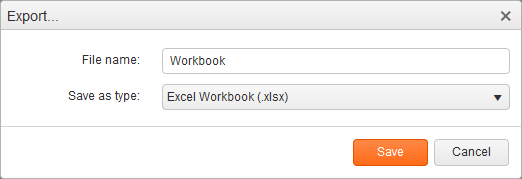

# Export to Excel

The Spreadsheet component utilizes the [Excel export module](/framework/excel/introduction) framework to produce Excel files directly in the browser. The output files are in the OOXML Spreadsheet format with an `.xlsx` extension. The legacy `.xls` binary format is not supported.

## User Interface

The default toolbar configuration includes an **Excel Export** button. Clicking on it opens a dialog box for entering the file name.

## API Export Reference

The Spreadsheet client-side API includes the [`saveAsExcel`](/api/javascript/ui/spreadsheet#methods-saveAsExcel) method for initiating the export via JavaScript.

This method will not ask you to specify a file name. Instead, it will set the value in [`excel.fileName`](/api/javascript/ui/spreadsheet.html#configuration-excel.fileName).

## Known Issues

Currently, the export module does not handle:

* Sorting and filtering
* Border styles

These will be addressed before the widget goes out of Beta.

## See Also

Other articles on Kendo UI Spreadsheet:

* [API Reference](/api/javascript/ui/spreadsheet)
* [Load and Save Data as JSON]()
* [Data Source Binding]()
* [Server-Side Processing]()
* [Custom Functions]()
* [Cell Formatting]()
