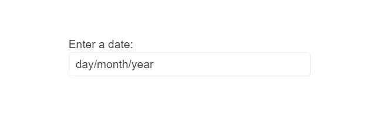

# {{ site.product }} DateInput Overview

The DateInput represents an input field that recognizes and formats scheduling values such as dates.

It provides separate sections for days, months, years, hours, and minutes, and also supports the customization of date and time formats.

## Functionality and Features

* [Selected Dates and Formats]()&mdash;The component enables you to create a non-editable DateInput with a selected date.
* [Floating Label]()&mdash;You can render a placeholder text for form or input fields, which floats above that field and remains visible once the user starts interacting with that field.
* [Date Editing]()&mdash;You can configure different `steps` for incrementing and decrementing the segments.
* [Appearance]()&mdash;The built-in options enable you to modify the component's appearance.
* [Integration with Other Editors]()&mdash;The DateInput provides options for integration with other Kendo UI editor components such as the DatePicker, DateTimePicker, and TimePicker.
* [Globalization]()&mdash;The component supports the translation of component messages (localization) and adapting them to specific cultures.

## Next Steps 

* [Getting Started with the Kendo UI DateInput for jQuery]()
* [Overview of the DateInput (Demo)](https://demos.telerik.com/kendo-ui/dateinput/index)
* [JavaScript API Reference of the DateInput](/api/javascript/ui/dateinput)

## See Also

* [Product Page of the Kendo UI for jQuery DateInput](https://www.telerik.com/kendo-jquery-ui/dateinput)
* [Demo Pages for the jQuery DateInput](https://demos.telerik.com/kendo-ui/dateinput/index)
* [Knowledge Base Section](/knowledge-base)
