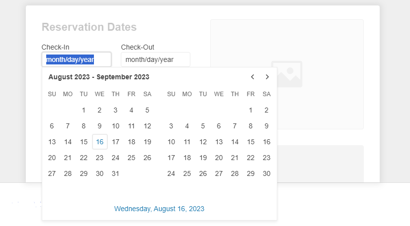

# {{ site.product }} DateRangePicker Overview

The DateRangePicker is a container for holding start and end date inputs.

It allows the user to select a date range from a calendar or through a direct input. The widget also supports custom templates for its `month` view, configuration options for minimum and maximum dates, a start view, and a depth for navigation. The first day of the week in the **Calendar** view depends on the applied [culture]().

## Functionality and Features

* [Disabled Dates]()&mdash;In the DateRangePicker, you can disable specific days, such as weekends and national holidays, so that they cannot be selected by the end user.
* [Selected Dates]()&mdash;The DateRangePicker allows you to render pre-selected dates and define date ranges.
* [Start View and Navigation Depth]()&mdash;The component allows you to change the default view.
* [Calendar Types]()&mdash;You can use a specific calendar type out of the supported DateTimePicker ones.
* [Reverse Selection]()&mdash;The component allows you to pick an end date which is before the start date.
* [Buttons]()&mdash;Learn more about the buttons supported by the component.
* [Automatic Correction]()&mdash;You can configure whether the component will autocorrect the user's input when the `min` and `max` dates are set.

## Next Steps

* [Getting Started with the Kendo UI DateRangePicker for jQuery]()
* [Overview of the DateRangePicker (Demo)](https://demos.telerik.com/kendo-ui/daterangepicker/index)
* [Using the API of the DateRangePicker (Demo)](https://demos.telerik.com/kendo-ui/daterangepicker/api)

## See Also

* [Basic Usage of the DateRangePicker (Demo)](https://demos.telerik.com/kendo-ui/daterangepicker/index)
* [Using the API of the DateRangePicker (Demo)](https://demos.telerik.com/kendo-ui/daterangepicker/api)
* [JavaScript API Reference of the DateRangePicker](/api/javascript/ui/daterangepicker)
