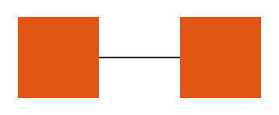

# Shapes

The Diagram enables you to add various shapes by using its [API reference on shapes](/api/javascript/dataviz/diagram/shape).

## Getting Started

To add a rectangular shape to the Diagram, call the `diagram.addShape();` method which renders a rectangle in the upper-left corner of the Diagram surface. To change the initial position, call the `addShape()` method with an additional `Point` parameter.

    var Point = kendo.dataviz.diagram.Point;
    diagram.addShape(new Point(100,220));

To specify additional properties for the Diagram, use the `options` parameter. The following example demonstrates how to set the background color of the shape.

    diagram.addShape(new Point(100,220), { background: "red" });

The `addShape()` method also accepts a `shape` instance and enables you to add a new shape.

    var Point = kendo.dataviz.diagram.Point;
    var shapeInstance = new kendo.diagram.Shape();
    var shape = diagram.addShape(shape);
    shape.position(new Point(100,220));

## Adding Connections

To connect the shapes, use the `connect()` method.

    var Point = kendo.dataviz.diagram.Point;
    var shape1 = diagram.addShape(new Point(100,100));
    var shape2 = diagram.addShape(new Point(300,100));
    var connection = diagram.connect(shape1, shape2);

The previous example results in the following output.

## Changing the Initial Options of the Shape

To change a particular configuration of the shape and visualize it, use the [`redraw()`](/api/javascript/dataviz/diagram/shape/methods/redraw) method which will render the shape with its new [`options`](/api/javascript/dataviz/diagram/shape#configuration).

    var shape = new kendo.dataviz.diagram.Shape({x: 500, y: 100, fill: "green"});
    diagram.addShape(shape);
    diagram.shapes[0].redraw({
    fill: {
        color: "red"
    }
    });

## Cloning a Shape

To make a clone of a shape and render it on the Diagram, use the [`clone()`](/api/javascript/dataviz/diagram/shape/methods/clone) method.

    var shape = new kendo.dataviz.diagram.Shape({x: 500, y: 100, fill: "green"});
    diagram.addShape(shape);

    var shape2 = diagram.shapes[0].clone();
    diagram.addShape(shape2);

## Creating a Shape Using SVG Path Data

To create a Diagram shape with an [SVG Path](https://www.w3.org/TR/SVG11/paths.html), use the [`path`](/api/javascript/dataviz/diagram/shape/configuration/path) configuration.

    var shape = new kendo.dataviz.diagram.Shape({path: 'm35.15,0 L84.85,0 L120,35.15 L120,84.85 L84.85,120 L35.15,120 L0,84.85 L0,35.15 z', fill: "green"});
    diagram.addShape(shape);

## See Also

* [Basic Usage of the Diagram (Demo)](https://demos.telerik.com/kendo-ui/diagram/index)
* [JavaScript API Reference of the Diagram](/api/javascript/dataviz/ui/diagram)
