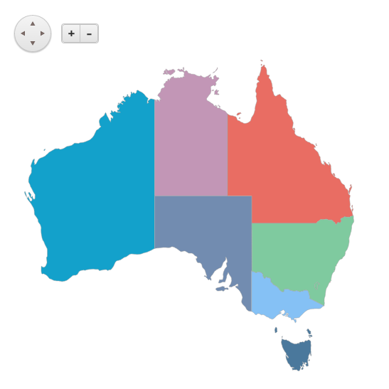
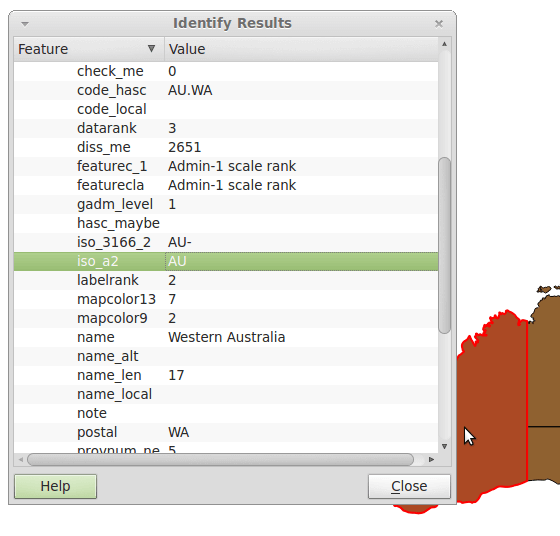
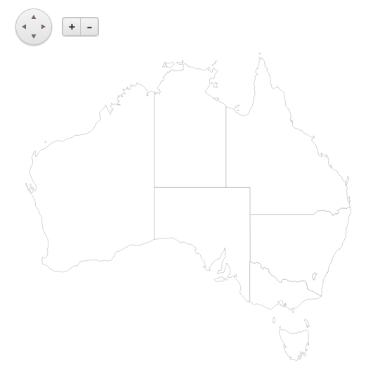

# Creating Maps

You can create a Kendo UI Map from scratch by using freely available map datasets.

The following examples demonstrate how to construct a map of the Australian states and mainland territories:

1. [Locate the external data for the map](#locating-an-external-map-dataset)
1. [Explore the data](#exploring-the-data)
1. [Process the data](#processing-the-data)
1. [Load the data](#loading-the-data)
1. [Add the styles](#adding-the-styles)

The following image demonstrates the expected map.

## Locating an External Map Dataset

To locate a map dataset that matches your requirements, use an official source for map data such as the [U.S. Census Bureau](http://www.census.gov) and [Ordnance Survey](http://www.ordnancesurvey.co.uk/).

The current map project of the Australian states and mainland territories uses data from the [Natural Earth project](http://www.naturalearthdata.com/). Natural Earth datasets cover the public domain and the project is supported by [NACIS](http://nacis.org/). It offers different data themes in the 1:10m, 1:50m, and 1:110m levels of detail. The current map project and examples use the [Admin 1 – States, provinces](http://www.naturalearthdata.com/downloads/50m-cultural-vectors) dataset. A scale of 1:50 000 000 provides a good detail/size balance on a country level. The dataset is available for download in [Esri Shapefile format](http://www.naturalearthdata.com/http//www.naturalearthdata.com/download/50m/cultural/ne_50m_admin_1_states_provinces_lakes.zip). For more information, refer to the website on [global administrative areas](http://www.gadm.org/country).

## Exploring the Data

To explore new map datasets, use a traditional [desktop geographic information system (GIS)](https://en.wikipedia.org/wiki/Geographic_information_system) application, for example, the open-source [QGIS](https://www.qgis.org/en/site/) project. [Import the Esri Shapefile](https://docs.qgis.org/testing/en/docs/user_manual/working_with_vector/index.html) for the data and by using the [Identify tool](https://docs.qgis.org/testing/en/docs/user_manual/introduction/general_tools.html#identify), inspect the available metadata. For the purpose of this project, you can narrow down your interest in features with the "AU" [ISO 3166-1 alpha-2](https://en.wikipedia.org/wiki/ISO_3166-1_alpha-2) country code.

## Processing the Data

You need to extract the data for the target region and process it in a usable format for the Map widget by converting it to GeoJSON. To convert between different vector formats, you can use the [OGR Library and utilities](https://gdal.org/development/rfc/rfc59.1_utilities_as_a_library.html) project which is part of the [Geospatial Data Abstraction Library](http://www.gdal.org/) and which includes the [ogr2ogr](http://www.gdal.org/ogr2ogr.html) command-line tool. As an alternative, you can also use the [Mapshaper](http://www.mapshaper.org/) tool that allows you to do many edits directly in the browser.

The following example demonstrates how to convert the dataset to GeoJSON and filter it out. As a result, your dataset is ready and can be displayed.

    ogr2ogr -f GeoJSON -where "iso_a2 = 'AU'" au-states.json ne_50m_admin_1_states_provinces_lakes.shp

## Loading the Data

The following example demonstrates how to set up a simple Map widget and add a single shape layer to it. The GeoJSON data source will point to your processed dataset.

> Make sure the GeoJSON files are properly encoded, preferably in UTF-8.

    

    

## Adding the Styles

The following example demonstrates how to define a palette and apply it based on the desired province. The `provnum_ne` field goes from 1 to 9 which denotes each mainland state and territory. To set the fill color of the newly created shape, this project uses the [`shapeCreated`](/api/dataviz/map#events-shapeCreated) event.

    

    

## See Also

* [Binding the Map to GeoJSON (Demo)](https://demos.telerik.com/kendo-ui/map/geojson)
* [JavaScript API Reference of the Map](/api/javascript/dataviz/ui/map)
