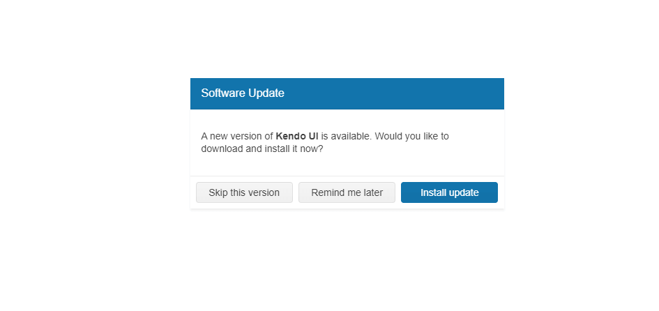

# {{ site.product }} Dialog Overview

The Dialog is a modal popup that brings information to the user.

The component also provides actions through its action buttons to prompt the user for input or to ask for a decision. The Dialog can also contain more complex UI elements that require the focus of the user. 

The Dialog is a subset of the [Kendo UI for jQuery Window](https://www.telerik.com/kendo-ui/window) where the most prominent difference is the added functionality for actions and predefined dialogs.

## Functionality and Features

* [Basic operations]()—The jQuery Dialog enables you to perform basic operations such as opening, closing, and destroying the component.
* [Predefined Dialog types]()—You can seamlessly integrate the predefined Dialog types and implement alert, prompt, and confirm dialogs for common use cases in your project.
* [Action buttons]()—The Dialog can also render action buttons, such as **OK** and **Cancel**, and allows you to define custom actions for each button.
* [Printing]()—You can also add a printing functionality to the Dialog component and enable the user to print its content.
* [Appearance]()—The Dialog allows you to customize its appearance by setting CSS classes, templates, and other styling options.

## Next Steps

* [Getting Started with the Kendo UI Dialog for jQuery]()
* [Dialog Overview (Demo)](https://demos.telerik.com/kendo-ui/dialog/index)
* [Using the API of the Dialog (Demo)](https://demos.telerik.com/kendo-ui/dialog/api)

## See Also

* [JavaScript API Reference of the Dialog](/api/javascript/ui/dialog)
* [Demo Page for the jQuery Dialog](https://demos.telerik.com/kendo-ui/dialog/index)
* [Knowledge Base Section](/knowledge-base)
* [jQuery Dialog Product Page](https://www.telerik.com/kendo-jquery-ui/dialog)