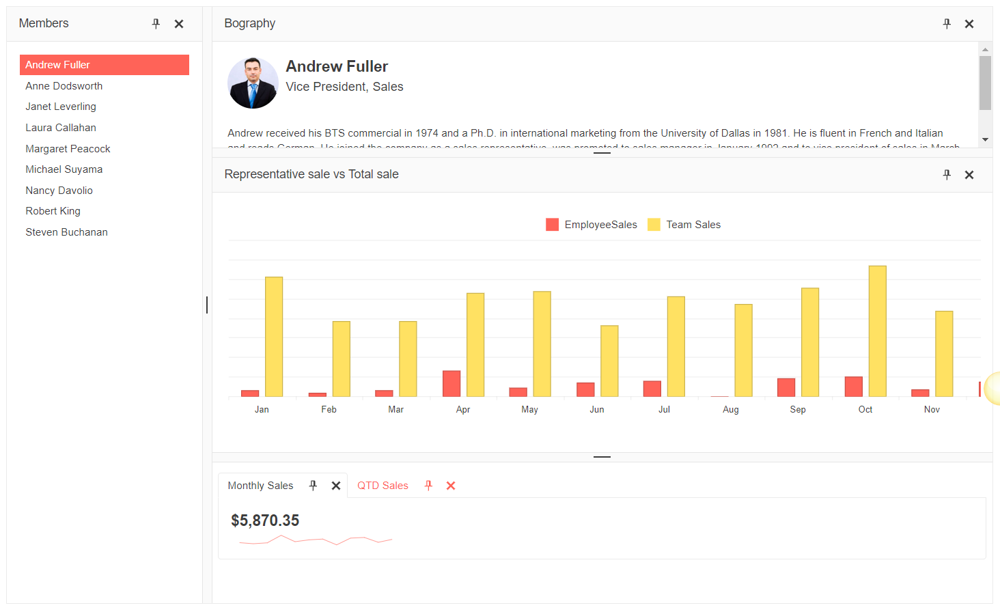

# {{ site.product }} DockManager Overview

The Dock Manager is a UI component that replicates the docks, along with their behaviors. It gives you the ability to have full control over the layout of your application through panes. This allows end users to alter the existing layout by pinning, resizing, moving, maximizing and hiding panes.

## Functionality and Features

* [Docking Panes()&mdash;You can dock panes globally or within other inner panes.
* [Pane Types]()&mdash;Use different pane types depending on the hierarchical structure you want to achieve.

## Next Steps 

* [Getting Started with the Kendo UI DockManager for jQuery]()
* [Overview of the DockManager (Demo)](https://demos.telerik.com/kendo-ui/dockmanager/index)
* [JavaScript API Reference of the DockManager](/api/javascript/ui/dockmanager)

## See Also

* [jQuery DockManager Product Page](https://www.telerik.com/kendo-jquery-ui/dockmanager)
* [Demo Page for the jQuery DockManager](https://demos.telerik.com/kendo-ui/dockmanager/index)
* [Knowledge Base Section](/knowledge-base)
