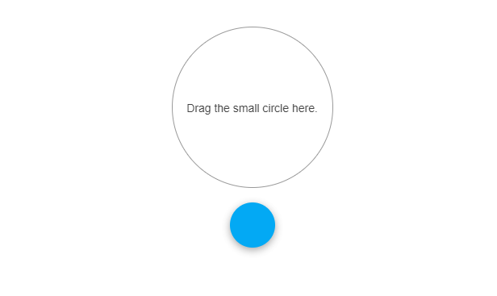

# Drag-and-Drop Overview

Kendo UI for jQuery provides options to handle drag-and-drop scenarios by combining the `kendoDraggable` and `kendoDropTarget` controls.  

`kendoDraggable` enables the Draggable functionality and allows a DOM element to be moved by using the mouse or a finger on touch devices.

`kendoDropTarget` creates the droppable zones and marks a DOM element as a drop target for the Draggable. The `DropTargetArea` enables you to create multiple `DropTarget` elements that are located in the area container which is a useful scenario when the `DropTarget` elements are added dynamically.

## Functionality and Features

* [Common Scenarios]()&mdash;Check various scenarios involving the Draggable component.

## Next Steps

* [Getting Started with the Kendo UI Draggable for jQuery]()
* [Basic Usage of the jQuery Draggable (Demo)](https://demos.telerik.com/kendo-ui/dragdrop/index)
* [JavaScript API Reference of the Draggable](/api/javascript/ui/draggable)

## See Also

* [Basic Usage of the Drag-and-Drop (Demo)](https://demos.telerik.com/kendo-ui/dragdrop/index)
* [API Reference of Draggable](/api/javascript/ui/draggable)
* [API Reference of DropTarget](/api/javascript/ui/droptarget)
* [API Reference of DropTargetArea](/api/javascript/ui/droptargetarea)
