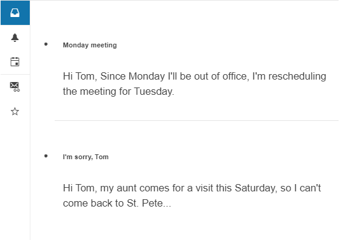

# {{ site.product }} Drawer Overview

The Drawer is a dismissible panel used for navigation in responsive web applications or for changing the content of a page section.

## Functionality and Features

* [Display modes]()–The Drawer provides a set of modes for handling the way the component is displayed.
* [Interaction modes]()–The Drawer provides a set of modes with which the user can interact, and positions in which the component can be rendered.
* [Templates]()–The Drawer enables you to modify the appearance of its content.
* [Hierarchy]()–The Drawer enables you to create a hierarchical structure.

## Next Steps

* [Getting Started with the Kendo UI Drawer for jQuery]()
* [Basic Usage of the jQuery Drawer (Demo)](https://demos.telerik.com/kendo-ui/drawer/index)
* [JavaScript API Reference of the Drawer](/api/javascript/ui/drawer)

## See Also

* [Product Page of the Kendo UI for jQuery Drawer](https://www.telerik.com/kendo-jquery-ui/drawer)
* [Demo Pages for the jQuery Drawer](https://demos.telerik.com/kendo-ui/drawer/index)
* [Knowledge Base Section](/knowledge-base)
