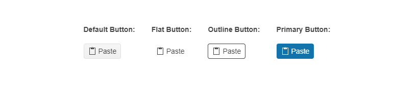

# {{ site.product }} DropDownButton Overview

The Kendo UI for jQuery DropDownButton widget combines a button with a drop-down element. It allows users to click the primary button and open the drop-down popup to choose from a list of additional actions.

## Functionality and Features

* [Items]()&mdash;The DropDownButton exposes multiple configurable options for its items.
* [Appearance]()&mdash;You can change the DropDownButton appearance by using different styling options.
* [Icons]()&mdash;The DropDownButton provides various options to display icons.
* [Accessibility]()&mdash;The component is accessible for screen readers, supports WAI-ARIA attributes, and delivers [keyboard shortcuts for faster navigation]().

## Next Steps

* [Getting Started with the Kendo UI DropDownButton for jQuery]()
* [Items in the DropDownButton]()
* [Appearance of the DropDownButton]()

## See Also

* [Overview of the DropDownButton (Demo)](https://demos.telerik.com/kendo-ui/dropdownbutton/index)
* [Using the Basic Events of the DropDownButton (Demo)](https://demos.telerik.com/kendo-ui/dropdownbutton/events)
* [Binding the DropDownButton over MVVM (Demo)](https://demos.telerik.com/kendo-ui/dropdownbutton/mvvm)
* [Applying the DropDownButton API (Demo)](https://demos.telerik.com/kendo-ui/dropdownbutton/api)
* [JavaScript API Reference of the DropDownButton](/api/javascript/ui/dropdownbutton)
