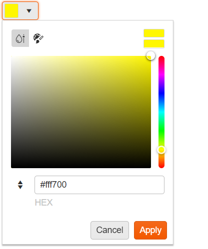
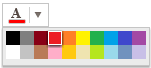
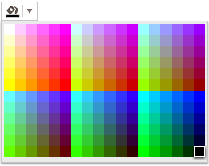

# ColorPicker Overview

The ColorPicker is a drop-down list for selecting colors.

It is designed to replace the HTML5 `<input type="color">` tag which is not widely supported in browsers.

* [Demo page for the ColorPicker](https://demos.telerik.com/kendo-ui/colorpicker/index)

## Basic Configuration

To initialize the ColorPicker, use a jQuery `ID` selector. The original `input` element is kept in the DOM. The `value` attribute element gets updated while the user selects a color which allows form submission.

```dojo
    <input type="color" id="myColorField" />

    <script>
        $(document).ready(function(){
            $("#myColorField").kendoColorPicker();
        });
    </script>
```

The default popup contains a gradient with HEX input.



The following example demonstrates how to create a simple ColorPicker and render 20 colors.

```dojo
    <input type="color" id="myColorField" />

    <script>
        $(document).ready(function(){
            $("#myColorField").kendoColorPicker({ 
            	views:["palette"],
                preview:false,
            	palette: "basic" 
            });
        });
    </script>
```



The following example demonstrates how to create a web-safe color palette with 216 colors.

```dojo
    <input type="color" id="myColorField" />

    <script>
        $(document).ready(function(){
            $("#myColorField").kendoColorPicker({ 
            	views:["palette"],
                preview:false,
            	palette: "websafe" 
            });
        });
    </script>
```



To display a custom list of colors in the ColorPicker, pass them in the `palette` argument. The following example demonstrates how to display the white, black, and red colors. You can render any other color by using its short (3 digits) or long (6 digits) hex notation and by omitting the `#` sign.

```dojo
    <input type="color" id="myColorField" />

    <script>
        $(document).ready(function(){
            $("#myColorField").kendoColorPicker({
            	views:["palette"],
                preview:false,
                palette: "#fff,#000,#f00"
            });
        });
    </script>
```

## Legacy ColorPicker Design

As of the end of 2021, the ColorPicker has a new design. The configuration from the example below shows how to revert to the old design of the widget:

```dojo
    <input id="picker" />
    <script>
        $("#picker").kendoColorPicker({
            input: false,
            preview:false,
            views: ["gradient"]
        });
    </script>
```

## See Also

* [Basic Usage of the ColorPicker (Demo)](https://demos.telerik.com/kendo-ui/colorpicker/index)
* [Using the API of the ColorPicker (Demo)](https://demos.telerik.com/kendo-ui/colorpicker/api)
* [JavaScript API Reference of the ColorPicker](/api/javascript/ui/colorpicker)
